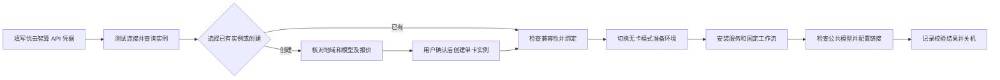
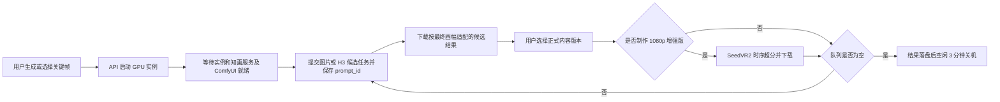
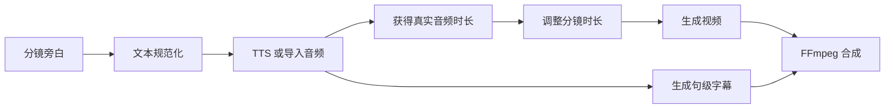
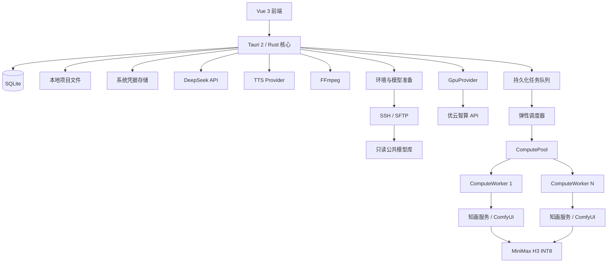

# 知画 MVP 产品与开发说明

> 版本：0.5\
> 状态：MVP 范围已更新，实施验收中\
> 最近更新：2026-09-11\
> 产品性质：非盈利、开源、本地优先、用户自备模型服务与算力\
> 目标平台：Windows 桌面端优先，架构保留跨平台能力

## 1. 产品定义

“知画”是一款面向教师、科普人员、学校宣传人员、公益组织和基层宣传工作者的桌面工具，用于把课件、文档和文字资料快速整理为简短的中文科普动画。

产品不追求成为专业视频剪辑软件，也不提供模型商城或平台积分体系。MVP 的核心价值是：

1. 将资料转换为可审核的知识点、旁白和分镜。
2. 用简单的分镜卡片组织参考素材、旁白和视频生成任务。
3. 通过用户自己的 DeepSeek、优云智算、ComfyUI 和 MiniMax H3 完成生成，并由桌面端尽量隐藏底层算力操作。
4. 保留每段内容的资料来源，让工作人员能核对事实。
5. 将生成片段、旁白、字幕和音乐组合为可直接使用的 MP4。

一句话定位：

> 导入课件，审核分镜，按需调用自己的算力生成科普动画。

## 2. MVP 成功标准

一名没有 ComfyUI 使用经验的教师能够完成以下流程：

1. 新建一个项目。
2. 导入 PDF、PPTX、DOCX、TXT 或粘贴文字。
3. 使用 DeepSeek 提取知识点并生成分镜初稿。
4. 审核、修改和重新排序分镜。
5. 为分镜上传图片，或在知画内生成、编辑分镜关键帧；在最终画幅中确认构图。
6. 生成系统旁白或导入已有录音。
7. 选择项目画幅和 5、10 或 15 秒片段时长，在优云智算上通过 ComfyUI + H3 生成候选视频。
8. 为每个分镜选择正式版本；候选原片可以直接进入时间线和导出，也可以按需制作 1080p 增强版。
9. 调整简单的时间线、字幕、转场和音量。
10. 导出一段约 30～90 秒、最高 1920×1080 的 MP4 视频。

完成上述流程时，用户不需要查看或编辑 ComfyUI 节点图、工作流 JSON、模型文件名和采样器参数。

## 3. 已确定的产品决策

### 3.1 MVP 使用的生成链路

- 文本规划：DeepSeek API。
- 视频生成：用户自己的优云智算实例。
- 云算力管理：MVP 实现优云智算实例绑定与引导创建、库存与报价查询、GPU/无卡启停、状态读取、服务健康检查和自动关机。
- 模型准备：优先使用所在可用区的只读公共模型库，自动检查文件并配置 ComfyUI 路径；缺失模型通过明确提示后的补充准备流程处理。
- 工作流执行：ComfyUI API。
- 图片生成与编辑：公共模型库中的 Qwen Image 2512 与 Qwen Image Edit 2511，通过 `ImageProvider` 和固定 ComfyUI 工作流提供分镜关键帧能力。
- 视频模型：MiniMax H3 INT8 量化工作流。
- 候选加速：经过固定版本验证的 H3 Turbo LoRA 8 步工作流。
- 可选高清处理：仅对已选正式版本按用户要求使用 SeedVR2 3B FP8 做时序超分和精确 1080p 输出；候选原片始终保留且可以直接交付。
- 视频合成：桌面端调用 FFmpeg。
- 项目数据：本地 SQLite 和本地项目目录。

### 3.2 分镜关键帧图片生成与编辑纳入 MVP

MVP 提供范围受控的分镜关键帧能力，不建设通用图片工作室：

- 上传、拖入、剪贴板粘贴图片，或使用 Qwen Image 2512 生成同项目画幅的图片候选。
- 使用 Qwen Image Edit 2511 完成提示词驱动的局部修改、风格调整和构图修正；不实现图层、蒙版绘制和专业修图工具。
- 标记角色、场景、道具、风格、首帧和尾帧，关联一个或多个分镜。
- 保留图片来源、提示词、seed、模型/工作流版本及编辑父版本。
- 将选定图片自动映射到 H3 的首帧、尾帧或 Ref2VA 参考输入。

上传图片和知画生成图片必须进入同一套非破坏性画幅适配流程。系统永久保留原图，并为每个项目画幅保存独立的 `FrameComposition`：来源版本、目标比例、缩放、位置、裁切矩形、主体焦点、填充方式、安全区和派生文件摘要。任何自动裁切或扩展都在最终画框中展示，并提供“可调整”入口；不得覆盖原图、静默拉伸或在生成视频后改变构图。

普通用户只看到最终成片画框。图片模型的原生尺寸、H3 的内部工作尺寸和额外边缘由程序处理。图片比例明显不一致时提供“智能扩展”“裁切填满”“完整显示”三种方式，默认优先保留主体。首帧和尾帧使用确认后的画框版本；Ref2VA 素材明确标注为角色、场景或运动参考，不暗示其构图会原样出现在结果中。

### 3.3 TTS 纳入 MVP

科普内容需要准确、可控的旁白。实测 H3 即使收到“不要说话”的提示也可能生成无法理解的伪外语对白，因此 H3 原生音轨不能作为正式旁白。

MVP 提供：

- 系统 TTS。
- 导入 WAV、MP3 等已有音频。
- 每个分镜独立生成或替换旁白。
- 语速和音量调整。
- 数字、单位和专业术语的读音预览。
- 根据旁白实际长度计算分镜时长。
- H3 音轨默认不进入成片；用户主动选择“保留环境音”时必须先试听，正式解说始终使用 TTS 或导入录音。

Windows MVP 优先调用系统语音能力。实现必须经过 `TtsProvider` 接口，后续可增加 sherpa-onnx、CosyVoice 或商业 TTS 适配器。

录音功能属于增强项；如果开发成本可控，可在 MVP 后半程加入，不阻塞主链路验收。

### 3.4 轻量费用提示

MVP 显示用户自有优云智算账户的可用余额，以及当前实例运行产生的费用信息，帮助用户判断是否启动、继续运行或关机。

- 设置与算力页显示可用余额，详情可展开现金和赠送余额；同时显示查询时间。
- 显示当前模式（GPU、无卡或已关机）、当前报价、运行时长和“本次运行估算”。无卡模式也可能收费。
- 本次估算按已记录的各运行模式及对应费率分段累计；费率或状态缺失时显示“暂无法估算”，不能按 0 元处理。
- 提供低余额提醒，默认以是否足够覆盖当前 GPU 报价约 1 小时作为提醒参考，可调整；查询失败显示最后更新时间及数据过期状态。
- 顶栏只保留简洁的算力状态与必要的低余额提示，不在分镜按钮或导出页铺设费用卡片。
- 不实现项目成本归因、单镜头账单、预算管理、平台积分、充值代收或复杂计费报表；提供平台账单与充值入口。

账户余额是账户级数据，可能受其他实例、服务、充值和赠送金影响，不能将余额差额直接算作知画消费。平台账单可能延迟；余额、运行估算和平台账单必须明确区分。价格来自 Provider 查询，附单位、计费模式和时间，不能写死测试报价；磁盘、镜像等费用若存在，单独提示关机后是否继续计费。

### 3.5 商业视频 API 暂不实现

代码保留视频服务抽象层，但 MVP 只实现 `ComfyUIH3Provider`。不接入 Seedance、Runway、可灵、MiniMax 商业 API 等真实服务。

### 3.6 云算力平台决策

MVP 主平台改为优云智算，实现 `CompShareProvider`。AutoDL 保留适配扩展点，不要求首版同时维护两个云平台。本次文档决策以产品目标和实测为依据，不受已实现的界面或代码限制。

- API 已实测支持创建实例、GPU/无卡启停、状态读取、库存及报价查询、定时关机设置和账户余额查询。
- 公共模型库已实测包含 H3 核心文件及图片生成、编辑模型，能够通过软链接接入 ComfyUI，减少下载、磁盘扩容和手动配置负担。
- 官方免费 ComfyUI 镜像可作为起点，由知画安装和校验固定版本的服务、工作流与依赖；不要求用户购买或制作私有镜像。
- 用户仍需完成平台账号注册、实名认证（如平台要求）、充值和 API 凭据配置；不能宣传为完全无需配置，也不能承诺 GPU 随时有库存。

地域按实际能力选择，不固定写死某一个可用区：

- 华北二 A 作为候选，支持 H3 公共仓库，但本轮创建因 5090 缺货失败。
- 上海二 A 已成功创建 5090 并完成模型与生命周期测试，可作为当前部署候选；它是 Pod 容器实例，访问方式和规格与华北二 A 不同。
- 上海二 B 虽查询到 5090 库存，但本轮 H3 仓库可用区域列表未包含该区，不能仅凭有 GPU 就推荐。
- 每次创建前同时核对单卡规格、模型仓库来源与区域可用性、镜像兼容性、磁盘和报价；库存检查通过不代表已预留资源。

默认只绑定和启动一台单卡实例。批量生成时可以由用户开启“弹性多路”，确认地域、单卡配置、按量报价、并发上限、实例上限与关机后的存储费用后，在该授权边界内临时创建或启用多个计算 worker。并发数不写死为六路，而是动态取任务数、用户上限、账号剩余配额、实时库存、余额保护线和服务就绪数的最小值。

调度单位统一为 `ComputeWorker`：单卡实例提供一个 worker；多卡实例在服务能够按 GPU 隔离时可以提供多个 worker。创建前逐个检查库存和报价，受控地并发创建；创建请求结果不明时先查询并对账，禁止盲目重试导致重复购买。不得超出用户已确认的并发、实例、地域、GPU 规格和费用上限。临时 worker 的结果完成本地校验后立即关机；主实例继续遵循用户设置的空闲关机策略。

费用完全由用户自己的平台账号承担，知画不代充值、不抽成、不售卖算力。私有镜像免费额度和存储政策不作为首版成立的前提。

### 3.7 图片、H3 与增强模型的镜像策略

MVP 默认使用精简模型组合，优先从公共模型库读取，不复制或下载模型仓库中的全部精度和变体：

| 模型档案 | 内容 | 权重总大小（非公共挂载本地占用） | MVP 要求 |
| --- | --- | ---: | --- |
| 核心档案 | FL2VA Pruned INT8、量化文本编码器、Video VAE、Audio VAE | 42.5GB | 必须 |
| 参考生成扩展 | Ref2VA Pruned INT8 | 额外约 21GB | MVP 必须，支持参考重制 |
| 候选加速档案 | 与核心权重匹配的 Turbo LoRA | 以固定清单为准 | MVP 必须 |
| 图片生成档案 | Qwen Image 2512 及编码器/VAE | 以固定清单为准 | MVP 必须，支持分镜关键帧 |
| 图片编辑档案 | Qwen Image Edit 2511 及编码器/VAE | 以固定清单为准 | MVP 必须，支持提示词编辑 |
| 1080p 增强档案 | SeedVR2 3B FP8 及对应节点 | 以固定清单为准 | 可选增强；缺失不阻塞候选与导出 |

公共库挂载时仅为所需文件配置路径或软链接；仍需检测系统盘中的依赖、缓存、输入和输出可用空间。只有用户选择补充下载时，才按待下载文件总大小加缓存与结果余量检查空间：完整核心档案建议至少 60GB 可用，含 Ref2VA 建议至少 85GB 可用。空间不足停止准备，不能静默扩容或填满磁盘。

模型库的仓库状态不等于逐文件可用。启动前必须核对本区来源、文件存在性、可读性、预期大小、格式及版本；同名 Hugging Face 与 ModelScope 仓库不能混用状态。缺失或版本不符时，提示更换兼容区域、等待公共库补齐或选择补充下载，不能后台自动下载数十 GB。

维护者不分发 H3 权重，仍须保留模型许可证、`NOTICE`、使用限制和来源。未来若公开分发含权重镜像，再单独确认再分发与地域条件。公共库读取及链接不代表许可证要求被免除。

### 3.8 画幅、时长、所见即所得与可选 1080p

- 画幅是项目级设置，分镜默认继承。MVP 固定提供“自动、1:1、4:3、3:4、16:9、9:16”，不提供 21:9 和任意自定义比例。
- 文生视频的“自动”默认使用 16:9；首帧、首尾帧和参考重制优先继承主参考素材的最接近比例。界面始终显示最终画布和适配预览，不允许静默拉伸。
- H3 内部宽高必须满足 32 的倍数。项目以“最终可见画框”为唯一构图基准，图片准备、候选预览、正式版本、可选 SeedVR2 和导出共用同一份 `FrameComposition`；用户不需要理解模型内部尺寸。
- 16:9 使用 1344×768 的 H3 工作画布和居中的 1344×756 可见区，上下各 6 像素作为不可见边缘；9:16 使用 768×1344 工作画布和 756×1344 可见区，左右各 6 像素作为不可见边缘。4:3、3:4、1:1 分别使用 1024×768、768×1024、768×768，不需要安全裁切。
- 对上传或生成的图片，程序先得到严格目标比例的可见版本，再通过边缘延展补齐 H3 工作画布。H3 输出帧在编码候选 MP4 前只裁切一次，候选文件本身即为最终比例；客户端直接播放该文件，SeedVR2 和导出不再次改变构图。
- 分镜生成时长固定为 5、10、15 秒。模型的实际帧时长允许略有偏差，进入时间线后通过末尾微裁切、静帧保持或短淡化对齐旁白和项目时长。
- 用户从候选中选择“正式版本”只确定内容版本。正式候选原片立即可以进入时间线并直接导出；1080p 是该正式版本的可选增强衍生文件，不是正式版本成立、全片预览或导出的前置条件。
- 用户主动选择后，SeedVR2 才处理正式版本：16:9 输出 1920×1080，9:16 输出 1080×1920，4:3 输出 1440×1080，3:4 输出 1080×1440，1:1 输出 1080×1080。原候选始终保留，超分失败不得影响正式版本和候选清晰度导出。
- 导出提供“候选原始清晰度”和“1080p”两类选择。1080p 导出优先使用 SeedVR2 增强文件；缺少增强文件时允许用户直接普通缩放，界面必须说明普通缩放不会增加真实细节，并提供可选的“一键补齐 AI 增强”。
- 16:9 的 1920×1080 链路已经实测。9:16、4:3、3:4、1:1 的最终尺寸必须在发布前逐项完成不拉伸、主体安全区和显存稳定性验收。

### 3.9 界面主题

MVP 提供浅色、深色和跟随系统三种主题。浅色为默认设计基线；主题切换即时生效并保存到本机设置。两套主题必须保持相同信息层级、状态颜色语义和无障碍对比度。

## 4. 用户与使用场景

### 4.1 目标用户

- 中小学教师和教研人员。
- 学校宣传、校园安全和德育工作人员。
- 科技馆、博物馆和科普场馆工作人员。
- 卫生、消防、反诈、应急和社区宣传人员。
- 公益组织和非营利机构内容人员。

### 4.2 典型内容

- 课程知识点说明。
- 实验原理和自然现象解释。
- 校园安全、消防、反诈和健康宣传。
- 活动介绍和公共服务说明。
- 课件的短视频补充材料。

## 5. 信息架构

主导航包含五个页面：

| 页面 | 主要职责 |
| --- | --- |
| 项目 | 新建、搜索、打开和管理项目 |
| 资料 | 导入资料、提取内容、生成知识点和核对来源 |
| 分镜 | 编辑旁白和画面方案、生成视频、选择版本、编排时间线 |
| 素材 | 管理参考图、角色、场景、道具、音频和视觉规范 |
| 导出 | 成片预览、完整性检查、编码设置和文件导出 |

“设置与算力”入口位于侧栏底部，用于配置 DeepSeek、优云智算、ComfyUI、TTS、FFmpeg、本地存储和界面主题，并承担首次环境准备、日常实例管理、轻量费用提示与可选防回收设置。

## 6. 核心用户流程


设计原则是“先审核内容，再消耗算力”。DeepSeek 生成的大纲、旁白和提示词都允许用户在提交视频任务前修改。

### 6.1 首次算力准备流程



首次准备在用户完成平台账号和凭据配置后由应用引导完成，不再要求用户到网页手动无卡开机。创建可能默认以 GPU 模式启动，报价确认时需说明这段开销；实例就绪后先关闭，再以无卡模式进行准备。若平台不支持无卡、无卡库存不足或启动失败，应明确提示，不得自动回退到付费 GPU 模式执行长时间维护。

准备过程中区分“连接平台、等待算力、环境准备、模型检查、准备完成”，显示可取消的真实进度。模型缺失的补充下载由用户明确选择后开始，并支持续传；首次模型准备不要求用户理解节点图或文件名。

### 6.2 日常生成流程



自动关机默认开启：远端队列为空、当前无执行任务、结果已成功下载到本地并记录完成后，空闲 3 分钟关机；倒计时期间可取消或因新任务自动取消。下载失败时先尝试恢复传输，并遵循已告知用户的运行时间上限，不能为了等待客户端无限保持 GPU 运行。

缺货显示“等待算力”，允许取消和有间隔的重试，保留本地任务；创建或启停超时先核对实例状态。应用退出、网络中断或任务失败时不得盲目重复提交任务，应先恢复远端状态。

### 6.3 本地使用与关机保障

- 编辑资料、分镜、素材、系统 TTS、预览本地结果和 FFmpeg 导出时不启动云实例；DeepSeek 调用也不依赖云 GPU。
- 无卡模式仅用于环境维护、模型准备、远端文件取回和可选防回收操作，不作为用户打开软件后的常驻模式。
- GPU 与无卡之间通过“确认关机完成 → 指定模式启动 → 探活”切换，不能把模式切换当作原地热切换。
- 每次开机为实例设置平台定时关机上限，默认本次开机后 60 分钟，启动前可调整；临近上限通知用户，继续运行需明确延长。不得静默无限顺延，上限可能中断未完成生成，需保留任务恢复信息。
- 知画云端服务提供队列、执行状态和结果取回状态，桌面据此执行空闲关机；平台定时关机作为客户端退出或断网时的独立保障。若设置失败，停止提交新任务并提示处理，不能显示“自动关机已保障”。
- 账号 API 私钥留在桌面系统凭据存储，不能为实现云端自主关机而复制到云端；不把容器内退出服务或执行系统关机视为平台计费停止。
- 主动关机后必须轮询确认已关机；停止接口成功只代表请求受理。扩容盘、付费镜像等若仍收费，界面继续提示。

### 6.4 可选的实例防回收

设置项名称为“软件运行时自动维护实例保留期”，默认关闭，用户首次启用时说明无卡费用和能力边界。

- 应用启动及运行期间每 6 小时检查一次，只维护知画当前绑定且已获授权管理的实例。
- 以平台 `ReleaseTime` 为优先依据；缺失时依据平台当前规则与最近成功关机时间显示“预计保留期限”，不能当作平台确认的日期。
- 距预计回收不足 48 小时、实例已关机且无任务时，执行一次无卡启动，确认运行后关机，并读取最新时间；不在每次打开软件时启动，不影响已有任务。
- 有 `ReleaseTime` 时验证是否延后；无该字段时记录启停及 `StopTime`，显示“维护已完成，回收期限待平台确认”，不得显示“防回收成功”。失败有退避和频率限制，每日最多自动尝试一次，并提示用户处理；不得自动改用 GPU 模式保活。
- 软件未运行、账号欠费、平台故障或资源被回收时无法保证保留。不安装后台常驻保活服务，不保证永久保留，也不自动重建或购买替代实例。
- 项目与正式输出始终本地保存，云端环境通过版本清单可重建；防回收不能代替备份。

无卡循环是否确实延后平台回收期尚待验证。该开关进入 MVP 需求，但正式发布前必须完成相应验收；未验证通过时禁用自动执行，保留期限提示和控制台入口。

## 7. 页面需求

设计稿目录：[`design/`](./design/)

### 7.1 项目页

最新参考设计：[`design/mvp-projects.png`](./design/mvp-projects.png)

必须实现：

- 新建项目。
- 打开、重命名、复制和删除项目。
- 搜索项目。
- 按最近编辑时间和状态筛选。
- 展示项目封面、分镜数量、总时长、状态和最近编辑时间。
- 自动保存最近打开的项目。

项目状态：

- 草稿。
- 编排中。
- 生成中。
- 待导出。
- 已完成。

新建项目时只要求填写项目名称，可选填写目标受众和目标时长，其他内容进入项目后再补充。

### 7.2 资料页

最新参考设计：[`design/mvp-sources.png`](./design/mvp-sources.png)

必须实现：

- 拖拽或选择 PDF、PPTX、DOCX、TXT 和常见图片。
- 粘贴纯文本。
- 展示解析进度、成功和失败状态。
- 查看提取后的文本。
- 启用或停用某个资料来源。
- 删除资料。
- 使用 DeepSeek 提取目标受众、建议时长、核心知识点和事实清单。
- 每个知识点保存 `sourceRefs`，可以定位到文件、页码或段落。
- 对缺少来源或存在冲突的内容标记“需要确认”。
- 用户确认后才能进入正式分镜生成。

MVP 不要求完整还原 PPT 或 PDF 的排版，只需要可靠地提取文本和图片，并记录来源位置。

### 7.3 分镜页

最新参考设计：[`design/mvp-storyboard.png`](./design/mvp-storyboard.png)

这是 MVP 的核心页面。

#### 分镜卡片

每张卡片至少展示：

- 序号和标题。
- 画面缩略图。
- 旁白摘要。
- 目标时长。
- 生成状态。
- 当前正式版本。
- 候选生成、1080p 处理或下载等真实任务阶段。

支持：

- 新增、复制、删除分镜。
- 拖拽排序。
- 编辑标题、知识目的、旁白、屏幕文字和画面描述。
- 查看引用来源。
- 绑定参考素材。
- 生成、取消、重试当前分镜。
- 批量生成选中分镜。
- 在多个结果中选择正式版本。

#### 视频预览

- 播放当前分镜或完整时间线。
- 显示当前字幕效果。
- 支持适应窗口和全屏预览。
- 切换生成版本。
- 设置入点和出点。

#### 分镜设置

普通用户只看到以下控制：

- 旁白文本。
- 参考素材。
- 生成方式。
- 项目画幅；分镜默认继承，允许回到项目设置统一修改。
- 5、10、15 秒时长。
- 快速候选或高质量候选。
- 生成图片关键帧、生成视频候选、设为正式版本，以及按需制作 1080p 增强版。
- H3 音轨处理，默认“不使用 H3 音轨”。

生成方式使用用户语言，不直接显示底层节点名称：

| 界面名称 | 底层能力 |
| --- | --- |
| 自由生成 | H3 文生视频 |
| 从这张画面开始 | H3 首帧图生视频 |
| 从画面 A 过渡到画面 B | H3 首尾帧视频 |
| 保持角色与场景 | H3 参考图/参考视频生成 |
| 延续上一镜头 | 使用上一片段或尾帧作为参考 |

图片、候选与成片遵循以下顺序：

1. 用户上传图片或生成、编辑分镜关键帧，在最终成片画框中确认构图；原图与画幅派生版本分别保存。
2. 用户用快速 8 步或高质量 20 步生成候选。服务在候选编码前完成唯一一次安全区裁切，客户端预览即为最终画幅。
3. 候选卡片显示提示词、seed、工作流版本、可见尺寸和音轨状态，支持对比播放。
4. “设为正式版本”只改变内容选择，不触发生成；正式候选立即可以进入时间线和导出。
5. “制作 1080p 增强版”是可选动作，只处理当前正式版本。20 步会重新生成内容，SeedVR2 则生成同一内容版本的高清衍生文件，两者不得混淆。
6. 断线或应用重启后先依据已保存的 `prompt_id` 查询远端状态，禁止重复提交同一任务。

#### 时间线

MVP 使用固定轨道，不实现任意多轨编辑：

1. 画面。
2. 旁白。
3. 字幕。
4. 音乐。

支持：

- 调整分镜顺序。
- 简单裁切。
- 设置分镜时长。
- 淡入淡出和基础转场。
- 调整旁白与音乐音量。
- 静音单条音轨。

不实现关键帧、蒙版、调色、曲线变速、复杂特效和自由多轨道。

### 7.4 素材页

最新参考设计：[`design/mvp-assets.png`](./design/mvp-assets.png)

必须实现：

- 上传、拖入和剪贴板粘贴图片。
- 导入 WAV、MP3 等音频。
- 按全部、角色、场景、道具、风格和音频分类。
- 搜索素材。
- 修改名称和分类。
- 查看尺寸、格式、来源和版本。
- 设置项目级参考素材。
- 关联或解除关联分镜。
- 替换文件但保留历史版本。
- 删除未使用素材。

项目视觉规范包括：

- 风格预设。
- 主色板。
- 线条和材质描述。
- 光线和背景复杂度。
- 角色设定图。
- 场景设定图。
- 禁止出现的元素。

MVP 不显示“生成图片”按钮。

### 7.5 导出页

最新参考设计：[`design/mvp-export.png`](./design/mvp-export.png)

必须实现：

- 播放完整成片。
- 展示分镜缩略图和总时长。
- 调整旁白、音乐和环境音音量。
- 检查分镜、旁白、字幕和来源记录是否完整。
- 选择保存位置。
- 导出 MP4。
- 显示导出进度、成功或失败原因。
- 导出失败后重试。

MVP 默认参数：

- 容器：MP4。
- 视频编码：H.264。
- 音频编码：AAC。
- 帧率：24 fps。
- 画布：16:9。
- 字幕：默认嵌入画面，同时允许保存 SRT。

导出页不展示任何费用信息。原设计稿中的费用卡片应替换为输出分辨率、总时长和预计文件大小。

### 7.6 设置页

最新参考设计：[`design/mvp-settings-compute.png`](./design/mvp-settings-compute.png)

必须实现：

- DeepSeek API 地址、模型名称和密钥。
- 优云智算 API 公钥、私钥、项目与实例选择，以及“打开优云智算控制台”。
- 引导创建：兼容地域、单卡规格、官方免费镜像、磁盘、当前库存与按量报价；用户确认后创建并绑定。
- ComfyUI 服务地址、客户端标识和可选鉴权信息，默认尝试自动检测。
- 测试 DeepSeek 连接。
- 分别测试优云智算 API、SSH、知画后端和 ComfyUI 连接。
- 显示优云智算实例的地域、GPU 型号、实例状态、服务状态和最后更新时间。
- 实例统一状态至少包括：未绑定、已关机、启动中、运行中、无卡运行、关机中、生成中、异常和库存不足。
- 首次准备向导：绑定或创建实例、无卡准备、公共库探测、服务与模型校验、准备完成。
- 检测 H3 模型文件、版本、大小、格式、清单摘要和磁盘可用空间，显示校验层级；全量 SHA-256 规则见 12.4。
- 显示模型检查、链接修复和失败重试状态；用户选择补充下载后再显示下载、断点续传与校验进度。
- 提供 GPU 启动、无卡维护、关机、连接服务、空闲自动关机与本次运行时间上限设置。
- 可用余额、当前模式费率、运行时长、本次运行估算、低余额提醒和平台账单入口。
- 实例保留期限、上次维护结果和可选防回收设置，明确显示平台时间或估计时间。
- TTS 声音、语速和默认音量。
- FFmpeg 路径检测。
- 项目默认保存目录。
- 浅色、深色和跟随系统主题。
- 下载日志和诊断信息。

实例地址与 SSH 端口通过 API 获取，不能写死公网 IP 或 22 端口。无卡状态依据实际模式字段判断；不同区域可能缺失报价、回收时间等字段，必须显示未知或查询其他已验证接口，不能补出虚假的状态。

所有密钥和令牌必须保存在操作系统凭据存储中，不能以明文写入 SQLite、日志或项目文件。

## 8. DeepSeek 编排设计

不要使用一次超长请求同时完成资料总结、脚本、分镜和视频提示词。流程拆为三个阶段。

### 8.1 内容规划

输入：

- 已启用的资料文本。
- 目标受众。
- 目标时长。
- 用户补充要求。

输出：

- 核心知识点。
- 内容大纲。
- 事实清单。
- 每条事实的来源引用。
- 缺失信息和需要确认的问题。

### 8.2 导演规划

用户确认内容大纲后，生成：

- 分镜目的。
- 旁白。
- 屏幕文字。
- 画面方案。
- 建议时长。
- 资料引用。
- 建议生成方式。
- 建议参考素材。

### 8.3 H3 提示词编译

提交生成前，将以下内容编译成 H3 提示词：

- 项目视觉规范。
- 角色和场景描述。
- 当前分镜画面目标。
- 动作。
- 镜头语言。
- 时间顺序。
- 参考素材标签。
- 禁止元素。

DeepSeek 不能直接创建或修改 ComfyUI 工作流 JSON。程序只允许将已验证字段注入固定、带版本号的工作流模板。

## 9. 旁白与字幕流程



规则：

- 一个分镜对应一段独立旁白音频。
- 旁白变更后，将该段音频和字幕标记为过期。
- 生成视频前提示用户重新生成旁白。
- 根据 `旁白时长 + 0.4 秒` 推荐最接近的 5、10 或 15 秒生成档位；时间线保持用户需要的精确时长。
- 旁白超过 15 秒时提示拆分分镜；短于生成片段时优先微裁切、静帧保持或短淡化，避免为零点几秒重新生成。
- 字幕文本以旁白脚本为准，不通过 ASR 反向生成。
- MVP 使用句级或短语级时间戳，不要求逐字高亮。

## 10. 风格一致性方案

风格一致性不能依赖相同 seed。MVP 通过以下机制降低漂移。

### 10.1 项目级风格锁

创建 `StyleProfile`，并自动加入所有分镜提示词：

```ts
interface StyleProfile {
  preset: "flat_education" | "paper_cut" | "whiteboard" | "soft_3d"
  palette: string[]
  lineStyle: string
  lighting: string
  backgroundComplexity: "simple" | "medium"
  characterRendering: string
  cameraLanguage: string
  forbiddenElements: string[]
}
```

### 10.2 参考资产集

项目可以指定：

- 风格参考图。
- 角色设定图。
- 常用场景图。
- 道具图。
- 已确认的视频片段。

生成时由程序按照素材类型映射到 H3 的参考输入，并在提示词中使用稳定的参考标签。

### 10.3 生成策略

- 无固定主体的镜头可以使用文生视频。
- 有固定人物、教室、实验场景时优先使用图生视频或参考生成。
- 状态变化优先使用首尾帧。
- 连续镜头可以使用上一镜头尾帧或上一视频作为参考。
- 避免连续多个相似全景，使用特写、示意图和文字卡片作为自然切换。

### 10.4 确定性叠加

以下元素不交给视频模型生成，而由桌面端或 FFmpeg 叠加：

- 字幕和标题。
- 数字、单位和公式。
- 箭头、标签和警示信息。
- Logo 和署名。
- 简单图表。

### 10.5 版本追踪

每个视频版本保存：

- 模型标识。
- 工作流模板版本。
- 提示词。
- seed。
- 参考素材版本。
- 分辨率、帧数、步数和质量档位。
- 生成时间和任务状态。

## 11. 技术架构



### 11.1 前端建议

- Vue 3。
- TypeScript。
- Vite。
- Pinia。
- Vue Router。
- UI 组件库选用一套即可，不同时混用多套。
- 拖拽排序使用轻量库。
- 视频与音频预览优先使用浏览器原生能力。

### 11.2 Tauri 核心职责

- 项目和文件管理。
- SQLite 数据访问。
- 安全读取密钥。
- DeepSeek 请求。
- ComfyUI 上传、提交、查询、取消和下载。
- 优云智算实例绑定、引导创建、库存与报价查询、GPU/无卡启停和自动关机。
- 余额、运行估算、定时关机上限和可选实例保留期维护。
- 通过 SSH/SFTP 探测公共模型库、校验清单、修复链接和初始化服务；补充下载时支持断点续传。
- 后台任务持久化。
- 计算池规划、worker 注册、任务分配、租约回收和多实例状态汇总。
- FFmpeg 调用。
- TTS 调用。
- 日志和故障诊断。

前端不能直接持有 DeepSeek 密钥、优云智算私钥、SSH 凭据或执行任意系统命令。云平台签名在 Rust 核心完成；凭据只用于对应平台的官方 API，SSH 登录信息按接口编码规则解码并留在内存中。

### 11.3 Provider 接口

```ts
interface LlmProvider {
  analyzeSources(request: AnalyzeRequest): Promise<ContentPlan>
  createStoryboard(request: StoryboardRequest): Promise<SceneDraft[]>
  compileVideoPrompt(request: PromptCompileRequest): Promise<string>
}

interface VideoProvider {
  getCapabilities(): Promise<VideoCapabilities>
  validate(request: VideoRequest): Promise<ValidationResult>
  submit(request: VideoRequest): Promise<VideoJob>
  getStatus(jobId: string): Promise<VideoJobStatus>
  cancel(jobId: string): Promise<void>
  getResult(jobId: string): Promise<VideoResult>
}

interface TtsProvider {
  listVoices(): Promise<TtsVoice[]>
  synthesize(request: TtsRequest): Promise<TtsResult>
}

interface ImageProvider {
  getCapabilities(): Promise<ImageCapabilities>
  generate(request: ImageRequest): Promise<ImageJob>
  edit(request: ImageEditRequest): Promise<ImageJob>
}

type GpuStartMode = "gpu" | "cpu_no_gpu"

interface GpuProvider {
  getCapabilities(): Promise<GpuProviderCapabilities>
  listInstances(): Promise<GpuInstance[]>
  getInstance(instanceId: string): Promise<GpuInstance>
  listDeploymentOptions(): Promise<GpuDeploymentOption[]>
  checkCapacity(request: GpuCreateRequest): Promise<GpuCapacity>
  quote(request: GpuCreateRequest): Promise<GpuPriceQuote>
  create(request: GpuCreateRequest): Promise<GpuInstance>
  start(instanceId: string, mode: GpuStartMode): Promise<void>
  stop(instanceId: string): Promise<void>
  getAccessInfo(instanceId: string): Promise<GpuAccessInfo>
  getMetrics(instanceId: string): Promise<GpuMetrics | null>
  getBalance(): Promise<GpuAccountBalance>
  getRunningPrice(instanceId: string): Promise<GpuPriceQuote | null>
  setStopDeadline(instanceId: string, unixTime: number): Promise<void>
  getRetentionInfo(instanceId: string): Promise<GpuRetentionInfo>
}

interface ComputePoolPolicy {
  mode: "single" | "elastic"
  maxWorkers: number
  maxInstances: number
  allowedRegions: string[]
  allowedGpuModels: string[]
  maxEstimatedCost?: Money
}

interface ComputeWorker {
  workerId: string
  instanceId: string
  gpuIndex?: number
  endpoint: string
  state: "starting" | "preparing" | "idle" | "busy" | "draining" | "offline"
  currentJobId?: string
}

interface ComputePool {
  plan(tasks: VideoTask[], policy: ComputePoolPolicy): Promise<ComputePoolPlan>
  acquire(plan: ComputePoolPlan): Promise<ComputeWorker[]>
  dispatch(tasks: VideoTask[], workers: ComputeWorker[]): Promise<JobAssignment[]>
  release(workerIds: string[]): Promise<void>
}
```

MVP 实现：

- `DeepSeekProvider`。
- `ComfyUIQwenImageProvider`。
- `ComfyUIH3Provider`。
- `SystemTtsProvider`。
- `CompShareProvider`，包括 GPU 与无卡模式能力。

预留但不实现：

- `AutoDlGpuProvider` 及其他云平台适配器。
- 商业视频、图片和在线 TTS Provider。

`GpuInstance` 必须保留地域、可用区、实际运行模式、原 GPU 规格、最近启动与关机时间以及可选回收时间。`ComputeWorker` 是任务调度和并发计算的最小单位，同一 worker 内的 H3 任务保持串行。每个 worker 独立维护知画服务地址、SSH 隧道或 HTTPS 访问信息、健康状态、能力清单和当前任务租约，不能复用单例连接状态。

价格与余额类型必须携带币种、单位、查询时间和可空值；弹性计划在执行前显示预计实例数、并发数、启动开销、生成时长区间和费用上限。保留期信息区分平台确认值与估计值。`create` 仅在用户确认配置或已启用的弹性策略边界内调用，不能由普通 `start` 或缺货重试隐式触发。库存检查只是创建前置判断，不代表资源已锁定；部分创建成功时保留可用 worker、回滚多余实例并重新规划剩余任务。云端模型清单、链接和固定工作流准备由独立的环境准备模块负责。

## 12. ComfyUI 与 H3 集成

### 12.1 工作流模板

应用内维护经过测试的只读模板：

- `qwen-image-generate-v1.json`。
- `qwen-image-edit-v1.json`。
- `h3-t2v-turbo-v1.json`。
- `h3-i2v-turbo-v1.json`。
- `h3-flf2v-turbo-v1.json`。
- `h3-ref2va-turbo-v1.json`。
- 对应的 20 步高质量候选模板。
- `seedvr2-1080p-v1.json`。

程序只能修改白名单字段：

- 正向提示词。
- 参考图片、视频和音频。
- 宽度和高度。
- 帧数或时长。
- seed。
- 图片生成/编辑的提示词、seed、输入图片和允许的画幅尺寸。
- 候选质量档位，以及可选 1080p 增强模板允许的输出尺寸。

禁止让 LLM 输出或改写工作流节点、连接和模型路径。

### 12.2 候选质量与成片处理

候选生成只显示两个档位，成片处理作为独立动作：

| 档位 | 用途 | 建议设置 |
| --- | --- | --- |
| 快速候选 | 快速检查动作、构图和参考一致性 | 1344×768 基准、Turbo、8 步 |
| 高质量候选 | 用户愿意用更多时间重新生成内容 | 相同安全像素预算、稳定工作流、20 步 |
| 1080p 增强 | 可选地放大已选正式版本并输出精确尺寸 | SeedVR2 3B FP8、时序超分、分块处理 |

20 步会重新采样并改变画面内容，不能显示为“高清修复”。1080p 增强不会替代候选选择，不是导出前置条件，默认也不处理未入选版本。具体节点参数放在版本化模板中，不作为普通 UI 设置；分块、重叠和显存参数仅用于诊断。

### 12.3 任务状态

统一状态枚举：

```ts
type JobStatus =
  | "queued"
  | "waiting_for_compute"
  | "preparing"
  | "uploading"
  | "running"
  | "upscaling"
  | "downloading"
  | "completed"
  | "failed"
  | "cancelled"
  | "interrupted"
```

应用重启后必须恢复未完成任务记录。提交成功后先持久化远端 `prompt_id`，再进入轮询。遇到 502、客户端重启或临时断网时先按 `prompt_id` 恢复远端状态；确实无法确认时标记为 `interrupted`，由用户选择重新查询或重试，不能静默重复提交。

### 12.4 优云智算环境与公共模型准备

MVP 优先采用经验证的官方免费 ComfyUI 容器镜像，并用版本化安装脚本部署知画云端服务及固定工作流。镜像 ID、版本和支持区域记录在兼容清单中，升级后重新验收，不追随 `latest` 自动升级。布局示意如下，实际路径需探测：

```text
实例系统盘（可写）
├── ComfyUI 与 Python 环境
├── 知画后端服务
├── 自定义节点与版本化工作流
├── /start.d/ 服务启动脚本
├── 公共模型检查、链接修复与补充下载脚本
└── LICENSE、NOTICE 与模型清单

/model（平台挂载的只读公共库，不打入知画镜像）
└── ModelScope/Comfy-Org/MiniMax-H3/

实例可写工作目录（配置指定）
├── models/（仅用户选择补充下载的模型）
├── input/
├── output/
└── cache/
```

约束：

- 探测真实挂载点，再通过 `extra_model_paths.yaml` 或软链接配置模型路径。不能仅凭目录 API 的 `CanonicalPath` 拼接路径；本轮接口给出 `/models`，上海二 A 实际挂载是 `/model`。
- 只读公共库不可修改；只在知画管理的配置中创建或修复链接，不覆盖用户有效文件。官方镜像已有模型选项不代表文件可读，必须检测失效链接。
- 环境镜像中不得包含维护者或测试账号的 API 密钥、SSH 私钥、Cookie、输入资料和生成结果。
- `MODEL_MANIFEST.json` 记录仓库来源、版本、相对文件路径、预期大小、SHA-256（取得可信摘要时）、许可证、必选/可选档案和兼容工作流版本。
- 公共库首次准备检查存在性、大小、可读性和 safetensors 头部结构；这不等于全文件完整性校验。完整性验收需取得可信摘要并读取计算 SHA-256，或使用经过验证的平台校验能力；界面明确区分“可读取”与“完整校验通过”。
- 首次发布前完成指定权重组合的全量校验与真实工作流验收，记录结果；日常启动执行轻量检查，文件大小、版本、来源变化或出现读取错误时使旧校验失效。公共库无不可变版本保证时，不能把旧校验作为文件从未变化的证明。
- 用户选择补充下载时支持断点续传，下载后做 SHA-256 校验；缺少可信摘要时不能宣称完整校验通过。只重下受影响文件，不静默复制完整仓库。
- H3 核心档案准备成功后才允许提交生成任务。
- `h3-ref2va-turbo-v1.json` 只有在 Ref2VA 扩展安装完成时启用，否则界面隐藏“保持角色与场景”生成方式并给出安装入口。
- SeedVR2 3B FP8、对应自定义节点和 `seedvr2-1080p-v1.json` 全部就绪后，才启用“制作 1080p 增强版”；未就绪不影响正式候选的预览、时间线和候选清晰度导出。
- 模型和节点升级不能静默进行，必须通过带版本号的清单迁移。

服务启动脚本必须幂等：重复执行不会重复安装依赖或覆盖用户数据；GPU 模式启动时自动拉起知画后端和 ComfyUI，无卡模式只执行准备与诊断任务。

当前 H3 核心文件清单：

- `diffusion_models/minimax_h3_fl2va_pruned_int8_convrot.safetensors`。
- `text_encoders/qwen3vl_32b_minimax_h3_nvfp4_awq.safetensors`。
- `vae/minimax_h3_video_vae_fp16.safetensors`。
- `vae/minimax_h3_audio_vae_fp32.safetensors`。
- 可选 `diffusion_models/minimax_h3_ref2va_pruned_int8_convrot.safetensors`。
- 与 H3 基础权重匹配的 Turbo LoRA，路径与摘要由 `MODEL_MANIFEST.json` 固定。
- Qwen Image 2512、Qwen Image Edit 2511 及其编码器/VAE，路径与摘要由 `MODEL_MANIFEST.json` 固定。
- SeedVR2 3B FP8 权重，路径与摘要由 `MODEL_MANIFEST.json` 固定。

图片模型、Turbo 与 SeedVR2 均必须在清单中列出固定版本、兼容基础权重、自定义节点和工作流；不能因为找到文件就视为链路已验收。

## 13. 核心数据模型

```ts
interface Project {
  id: string
  title: string
  audience?: string
  targetDurationSec?: number
  status: "draft" | "planning" | "generating" | "ready" | "completed"
  styleProfile: StyleProfile
  createdAt: string
  updatedAt: string
}

interface SourceDocument {
  id: string
  projectId: string
  name: string
  type: "pdf" | "pptx" | "docx" | "txt" | "image" | "pasted_text"
  filePath?: string
  extractedTextPath?: string
  enabled: boolean
  parseStatus: "pending" | "parsing" | "ready" | "failed"
}

interface SourceReference {
  sourceId: string
  page?: number
  paragraph?: number
  quote?: string
}

interface Scene {
  id: string
  projectId: string
  order: number
  title: string
  purpose: string
  sourceRefs: SourceReference[]
  narration: string
  onScreenText: string[]
  visualPlan: string
  generationMode: "t2v" | "i2v" | "flf2v" | "r2v" | "continue"
  targetDurationMs: number
  assetIds: string[]
  selectedVersionId?: string
  status: "draft" | "ready" | "generating" | "generated" | "approved" | "failed"
}

interface VisualAsset {
  id: string
  projectId: string
  name: string
  type: "character" | "scene" | "prop" | "style" | "first_frame" | "last_frame"
  source: "upload" | "clipboard" | "generated" | "edited"
  filePath: string
  prompt?: string
  seed?: number
  workflowVersion?: string
  parentAssetId?: string
  version: number
}

interface FrameComposition {
  id: string
  assetId: string
  aspectRatio: "1:1" | "4:3" | "3:4" | "16:9" | "9:16"
  fitMode: "extend" | "cover" | "contain"
  scale: number
  offsetX: number
  offsetY: number
  cropRect: { x: number; y: number; width: number; height: number }
  focusPoint?: { x: number; y: number }
  visibleWidth: number
  visibleHeight: number
  h3InputPath: string
  h3InputWidth: number
  h3InputHeight: number
  sha256: string
}

interface MediaVersion {
  id: string
  sceneId: string
  kind: "candidate_video" | "enhanced_video" | "narration"
  sourceCandidateId?: string
  filePath: string
  prompt?: string
  seed?: number
  workflowVersion?: string
  durationMs: number
  createdAt: string
}
```

## 14. 本地文件结构

建议一个项目对应一个独立目录：

```text
projects/<project-id>/
├── project.json
├── sources/
├── extracted/
├── assets/
│   ├── images/
│   │   ├── originals/
│   │   ├── generated/
│   │   └── compositions/
│   └── audio/
├── scenes/
│   └── <scene-id>/
│       ├── drafts/
│       ├── final/
│       └── narration/
├── subtitles/
├── exports/
└── cache/
```

SQLite 保存关系、状态和索引；大型媒体文件保存在项目目录。项目应可以整体复制和备份。

## 15. 自动保存与版本规则

- 文本编辑停止后短暂延迟自动保存。
- 切换页面和关闭窗口前强制保存。
- 生成媒体不覆盖旧版本。
- 用户选择某个正式版本后，仅更新引用关系。
- 删除被时间线引用的媒体前必须提示。
- 应用异常退出后，项目文本和任务状态可以恢复。
- 缓存可以清理，项目源文件和正式媒体不能被自动清理。

## 16. 错误处理

必须提供用户可理解的错误信息：

- DeepSeek 密钥错误、限流或结构化输出失败。
- 文件格式不支持或解析失败。
- ComfyUI 无法连接。
- 工作流缺少模型或节点。
- 参考素材上传失败。
- 优云智算 API 凭据无效、权限不足、余额不足、实例不存在、GPU 库存不足或状态转换超时。
- 创建结果不明、模式切换冲突或无卡模式不可用。
- 公共模型库未挂载、指定来源在该区不可用、模型链接失效或版本不符。
- 模型补充下载中断、校验失败或可写目录空间不足。
- 优云智算实例关闭、ComfyUI 未就绪或任务中断。
- 定时关机设置失败、无法确认关机完成、保留期未知或自动维护失败。
- H3 显存不足。
- FFmpeg 不存在或导出失败。

错误提示应包含：发生了什么、是否影响已有数据、建议的下一步、可复制的诊断编号。详细堆栈只写入本地日志。

## 17. 非功能要求

### 17.1 隐私与安全

- 默认所有项目和媒体保存在本地。
- 上传到 DeepSeek 的内容必须在设置和首次调用时说明。
- 上传到优云智算实例的素材范围必须与当前任务一致。
- DeepSeek 密钥、优云智算 API 私钥和持久保存的 SSH 凭据只保存在操作系统凭据存储，不同步到任何知画云端服务。
- 密钥不得写入日志、SQLite、项目文件或导出的诊断包。
- 日志导出前自动遮蔽令牌、密钥和带鉴权参数的 URL。

### 17.2 可用性

- 普通用户不需要理解模型、节点或采样器。
- 所有耗时任务提供进度和取消按钮。
- 远端断开不导致本地项目损坏。
- 页面刷新和应用重启后不丢失编辑结果。
- 主要操作按钮使用明确动词。
- 浅色、深色和跟随系统主题均覆盖所有核心页面，切换主题不影响任务状态。
- 算力页面用“已关机、启动中、服务准备中、可生成”等用户语言，不暴露云平台内部状态码。

### 17.3 性能

- 媒体缩略图异步加载。
- 原视频不直接全部载入内存。
- 文件解析、上传、下载和 FFmpeg 在后台执行。
- 默认单 worker 串行，避免单张显卡同时执行多个 H3 任务。开启弹性多路后，不同 worker 可并行执行，单个 worker 仍保持串行。

## 18. MVP 不做的功能

- 通用图片工作室、图层系统、手绘蒙版、专业修图和批量平面设计；MVP 只做分镜关键帧生成、提示词编辑和画幅适配。
- 商业视频 API 的真实接入。
- AutoDL 等第二云平台的真实接入。
- 未经用户确认或超出已确认弹性策略的实例购买、扩容、跨区迁移，以及缺货时自动新建不同规格的替代实例。
- 软件关闭后的后台常驻保活与永久防回收保证。
- 在线账号和云同步。
- 多人协作和权限系统。
- 平台积分、项目预算、单镜头成本和复杂计费报表；账户余额与本次运行估算按 3.4 实现。
- 模型商城和工作流商城。
- 专业非线性剪辑器。
- 任意多轨、关键帧、蒙版和调色。
- 角色 LoRA 训练。
- 实时协同审核。
- 移动端。

## 19. 开发阶段

### 阶段一：跑通单分镜

- 初始化 Vue 3 + Tauri 2。
- 建立设置和安全凭据存储。
- 实现 DeepSeek 连接测试。
- 实现优云智算凭据、实例绑定、引导创建、兼容地域选择、库存与报价查询。
- 实现 GPU/无卡启停、首次环境准备、SSH 公共库检查、链接修复和清单校验。
- 实现余额、运行估算、空闲关机、平台定时关机上限和缺货重试。
- 实现知画后端与 ComfyUI 连接测试和健康检查。
- 固定 H3 文生视频、首帧、首尾帧和 Ref2VA 参考重制工作流。
- 完成提示词、参考素材、项目画幅、5/10/15 秒和 seed 注入。
- 提交候选任务并下载、预览视频；候选可直接设为正式版本并导出，1080p 增强按需执行。

验收：用户完成优云智算账号与凭据配置后，可以在知画内绑定或确认创建实例，自动完成无卡准备与公共模型配置；输入旁白、画面描述和参考图后，可以启动 GPU、得到本地视频片段并按设置关机。缺货不丢任务，费用与状态可见。必须在目标区域的实际 5090 配置上验证完整生成，不能只依据 ComfyUI 探活通过。

### 阶段二：项目、资料与分镜

- SQLite 和项目目录。
- 项目页。
- 资料导入和文本提取。
- DeepSeek 内容规划和导演规划。
- 分镜卡片增删改、排序和引用来源。
- 素材库和分镜绑定。
- 接入 Qwen Image 2512 / Qwen Image Edit 2511 的固定工作流和 `ImageProvider`。
- 实现上传与生成图片共用的 `FrameComposition`、非破坏性画幅适配、主体安全区和 H3 工作图派生。

验收：用户可以从一份资料生成 5 个左右可编辑分镜，并保存后重新打开。

### 阶段三：旁白、任务和版本

- 系统 TTS 和音频导入。
- 句级字幕。
- 持久化任务队列。
- 实现默认单路、可选弹性多路的 `ComputePool` 与 worker 租约；并发数按任务、配额、库存、余额和用户上限动态计算，不写死路数。
- 快速候选/高质量候选，以及独立、可选的 1080p 增强处理。
- 取消、重试和故障恢复。
- 多版本选择。
- H3 首帧、首尾帧和参考生成。
- 实例保留期限提示与可选无卡维护，完成回收期效果验收后再开放自动执行。

验收：用户可以为全部分镜生成旁白和视频，并逐一选择正式版本；不制作 1080p 也能完成预览和导出。默认只启动一个 worker，开启弹性多路后可将不同分镜分配给多个可用 worker，失败或重启不重复提交，同一分镜不会被两个 worker 同时处理。

### 阶段四：时间线与导出

- 固定四轨时间线。
- 裁切、转场和音量。
- 字幕样式。
- FFmpeg 合成。
- 导出检查和错误恢复。

验收：用户可以导出一段画面、旁白、字幕同步的 30～90 秒 MP4。

## 20. MVP 验收清单

### 项目与资料

- [ ] 可以创建、重命名、复制、删除和重新打开项目。
- [ ] 可以导入至少 PDF、PPTX、DOCX 和 TXT。
- [ ] 可以查看提取文本和来源位置。
- [ ] DeepSeek 输出可以通过结构校验，失败时可以重试。
- [ ] 每个知识点和分镜可以关联资料来源。

### 分镜与素材

- [ ] 可以生成、编辑、复制、删除和排序分镜。
- [ ] 可以上传、粘贴、分类和版本化参考图片。
- [ ] 可以为分镜指定首帧、尾帧、角色和场景素材。
- [ ] 可以设置并锁定项目视觉规范。
- [ ] 项目可选择自动、1:1、4:3、3:4、16:9、9:16，所有分镜正确继承且适配预览不拉伸。
- [ ] 上传图片和知画生成/编辑图片使用同一 `FrameComposition`；原图不被覆盖，自动裁切或扩展可见、可调且可复现。
- [ ] 首帧、尾帧、候选预览和导出使用同一最终画框；16:9/9:16 的 H3 不可见边缘不会在后续阶段造成构图跳变。

### 旁白与视频

- [ ] 可以生成系统 TTS 或导入旁白。
- [ ] 旁白时长可以驱动分镜时长。
- [ ] 可以绑定优云智算实例并显示地域、实际 GPU/无卡状态与服务状态。
- [ ] 可以查询兼容配置、模型区域、库存和分项报价；默认只创建一台实例，开启弹性多路后也不超过用户确认的并发数、实例数、地域、GPU 规格和费用上限，超时恢复不重复购买。
- [ ] 首次准备可自动切换无卡模式、部署服务、检测公共库、校验核心文件并配置链接；缺失模型不静默下载。
- [ ] 用户选择补充下载时可续传、校验，磁盘不足时停止并提示。
- [ ] 可以通过 API 完成 GPU → 关机 → 无卡 → 关机 → GPU，配置和模型链接保留。
- [ ] 可以检测知画后端、ComfyUI、H3 模型和 FFmpeg 是否就绪。
- [ ] 队列完成后可以按用户设置自动关机，并允许取消关机。
- [ ] 结果确认本地落盘后才进入空闲关机，断网或下载失败遵循运行上限且可以恢复结果。
- [ ] 平台定时关机设置后读回一致，并实测客户端退出时到点关闭；设置失败不继续提交新任务。
- [ ] 文档编辑、本地预览、系统 TTS 和 FFmpeg 导出不启动云实例。
- [ ] 可以连接 ComfyUI 并提交 H3 任务。
- [ ] 可以查看队列、进度、失败原因并取消或重试。
- [ ] 弹性调度可根据任务数、账号配额、库存、余额保护线和用户上限动态规划 worker；支持部分创建成功、服务准备失败、任务租约超时和客户端重启后的安全对账。
- [ ] 临时 worker 在结果下载并校验后立即关机；主实例按空闲策略关机。多路运行时费用按 worker 汇总，并与单路预计耗时并列展示。
- [ ] 可以生成 5、10、15 秒的快速候选和高质量候选，并清楚说明 20 步会重新生成内容。
- [ ] 每个分镜可以保留多个版本并选择正式版本。
- [ ] 正式候选原片无需 SeedVR2 即可进入时间线、完整预览和导出。
- [ ] 只有正式版本可按用户选择进入 SeedVR2，能够输出精确 1080p 尺寸并在失败后保留原候选；界面在提交前显示预计时间和费用。
- [ ] 默认成片不使用 H3 原生音轨；选择保留环境音时必须先试听，TTS/导入录音始终是正式旁白。
- [ ] 目标地域 5090 上完成四种 H3 输入方式、5/10/15 秒、Ref2VA 与 SeedVR2 的真实生成，记录耗时、峰值显存/内存、模型加载与回传时间；64GB 与 96GB 配置不能直接互认性能结果。

### 费用与保留期

- [ ] 余额、费率、运行时长与本次估算有真实来源及更新时间；未知数据不显示为零。
- [ ] GPU/无卡分段估算与实际账单抽样核对，区分余额、估算与延迟账单，不将账户差额作为项目成本。
- [ ] 低余额和可能继续计费的存储有明确提示，费用功能限于 3.4 约定范围。
- [ ] 保留期能区分平台值和估计值；应用运行时按频率检查，缺少 `ReleaseTime` 不声称已确认延后。
- [ ] 自动防回收启用前，用受支持的目标实例确认无卡循环确实刷新保留期（平台期限字段、可核验控制台记录或平台明确确认），测试维护失败与应用未运行的提示；不具备证据时保持开关禁用。

### 导出与可靠性

- [x] 可以预览完整时间线。
- [ ] 可以调整旁白和音乐音量。
- [ ] 可以导出 H.264 + AAC 的 MP4 和独立 SRT。
- [ ] 导出可选择候选原始清晰度或 1080p；1080p 缺少 AI 增强时允许普通缩放并明确提示质量差异，不强制启动 GPU。
- [ ] 应用重启后项目、媒体版本和任务记录仍然存在。
- [ ] 日志不包含明文密钥。
- [x] 浅色、深色和跟随系统主题可正常切换并持久化。
- [ ] 日志与诊断包不包含 API 私钥、实例密码或带鉴权参数的完整 URL。
- [ ] 新账号从安装客户端到导出 30～90 秒成片可完整走通，用户全程无需打开 ComfyUI。
- [ ] 图片生成/编辑、视频生成、下载、可选 1080p 处理和自动关机阶段中断后可恢复，不重复提交任务。
- [ ] 在目标账号许可范围内完成 1、2、4 个 worker 的同批任务实测，记录实例初始化、服务就绪、模型首载、生成、回传和关机耗时，验证并发收益与费用估算；更高并发由同一策略动态扩展，不作为写死上限。
- [ ] 至少完成 16:9、9:16、1:1 的 5 秒真实视频验收；成片尺寸正确、画面不拉伸、主体未被误裁切且无未确认对白。
- [ ] 客户端、知画云端服务、工作流和模型清单执行版本握手，任一不兼容时阻止提交并支持回滚。

## 21. 原型图使用说明

当前六张浅色设计图是 MVP 的统一实现基线，采用同一套桌面外壳、字号、间距和状态语义：

- [`项目`](./design/mvp-projects.png)
- [`资料`](./design/mvp-sources.png)
- [`分镜`](./design/mvp-storyboard.png)
- [`素材`](./design/mvp-assets.png)
- [`导出`](./design/mvp-export.png)
- [`设置与算力`](./design/mvp-settings-compute.png)

实现时优先遵循本文档的功能范围。分镜页重点表达项目画幅、关键帧生成/编辑、5/10/15 秒、四种 H3 输入方式、候选版本、正式版本、可选 1080p 增强、真实任务阶段和顶栏轻量算力状态。图片生成入口放在分镜工作流，素材页管理其产物和版本，不扩展成独立通用创作页。设置与算力页使用顶部横向分类，承担余额、实例保留期维护、自动关机和环境检查；导出页不显示项目费用。

视觉方向采用“清透桌面”：浅色使用蓝灰背景与白色面板，蓝色作为主操作。当前 `design` 目录只保存六张浅色实现基线；深色主题在实现时复用相同布局与状态语义，通过语义色变量映射，不将浅色界面直接反色。

## 22. 云平台规则依据与复核要求

本文档记录的是 2026-09-08 的产品决策，云平台价格、容量、API 和回收规则可能变化，不能作为永久常量写死在业务代码中。

- 优云智算创建与库存：<https://compshare.cn/docs/gpus/instance/createcompshareinstance>、<https://compshare.cn/docs/gpus/instance/checkcompshareresourcecapacity>
- 实例状态与运行模式：<https://compshare.cn/docs/gpus/instance/describecompshareinstance>
- 报价：<https://compshare.cn/docs/gpus/instance/getcompshareinstanceuserprice>
- 公共模型库：<https://compshare.cn/docs/operation/gpu/usepublicmodel>、<https://compshare.cn/docs/gpus/instance/describemodelrepositorymodels>
- 定时关机：<https://compshare.cn/docs/gpus/instance/updatecompsharestopscheduler>
- 无卡模式与回收规则：<https://compshare.cn/docs/operation/gpu/cardlessmode>、<https://compshare.cn/docs/operation/charge/recycle>
- 优云智算最新 GPU 产品更新：<https://www.compshare.cn/docs/overview/announcement/update-gpu>
- 优云智算实例与磁盘规则：<https://www.compshare.cn/docs/operation/gpu/disk>
- 优云智算无卡启动 API：<https://compshare.cn/docs/gpus/instance/startcompshareinstance>

发布每个正式版本前必须重新核对上述页面。若通用计费页与专项更新公告冲突，先按更保守规则设计，再通过平台客服或实际账单确认。知画只依据 Provider 能力返回值启用功能，不依据平台名称猜测功能。

### 22.1 本轮实测证据与边界

以下为平台实验记录，不代表知画功能已实现或第 20 节已验收：

| 项目 | 2026-09-08 实测结果 |
| --- | --- |
| 创建与配置 | 上海二 A：单卡 RTX 5090 32GB、14 核、64GB 内存、100GB 系统盘，官方免费 ComfyUI 0.33.0 镜像创建成功 |
| 报价与余额 | 创建计算报价 3.20 元/小时，磁盘报价为 0；测试前后余额反映 0.31 元扣费，账单明细接口当时仍为空；价格仅为快照 |
| 公共库 | 只读 UPFS 挂载在 `/model`；H3 核心与可选 Ref2VA 文件可读取并解析头部 |
| 图片能力 | 公共库中的 Qwen Image 2512、Qwen Image Edit 2511 及所需编码器/VAE 已完成真实文生图与图片编辑推理；客户端已完成上传图片的非破坏性画幅适配、FFmpeg 派生和 H3 输入替换，Qwen 客户端 Provider 与固定服务工作流仍待接入 |
| H3 基础能力 | 文生视频、首帧图生视频、首尾帧视频和 Ref2VA 参考重制均已真实生成，所用权重来自公共模型库，未下载模型权重 |
| 5/10/15 秒 | FL2VA Turbo 1344×768 分别约 167.3、387.1、786.7 秒，峰值显存约 32.14GiB；用于容量估算，不作为所有镜头的服务承诺 |
| Ref2VA | 1344×768、5 秒的 match/max 参考模式分别约 279.6/269.4 秒，已验证可运行 |
| Turbo | 8 步 Turbo 的 5 秒结果约 167.3 秒；同机 20 步约 302.2 秒，耗时降低约 44.6%，质量仍需按内容抽样验收 |
| 1080p | 1080p 是正式候选的可选增强。1344×768 候选经画幅适配后，使用 SeedVR2 3B FP8、batch 13、overlap 3 输出精确 1920×1080，约 174.17 秒，峰值显存约 23.47GiB；片段边界稳定性检查通过 |
| H3 音轨 | “不要说话”仍产生疑似伪意大利语的不可理解对白；SeedVR2 基本原样保留该音轨，因此正式成片默认弃用 H3 音轨 |
| 服务边界 | 知画云端服务已部署，桌面端原生 Rust 客户端已通过版本握手、幂等任务恢复与结果清单解析；已完成单条 5 秒 H3 → SeedVR2 → 本地下载闭环，30～90 秒多分镜成片仍待验收 |
| 生命周期 | GPU → 关机 → 无卡 → 关机 → GPU → 关机完整执行；SSH、Jupyter HTTPS/WebSocket 可用，恢复 GPU 后服务与链接正常 |
| 无卡表现 | 2 核、4GB 内存、0 GPU，公共库仍可读；默认 ComfyUI 未就绪，维护不能依赖 GPU 服务 |
| 定时关机 | 设置和更新成功，可读回时间；未等待到点触发 |
| 回收期 | 无卡循环后 `StopTime` 更新，但该 Pod 实例未返回 `ReleaseTime`，不能认定防回收已通过验证 |
| 收尾 | 所有测试实例已确认关机；详细结果见 `validation/2026-09-08-workflows/验证报告.md` 与 `validation/2026-09-08-highres/验证报告.md` |

### 22.2 实施验收前仍需补测

模型基础能力已经足够支撑 MVP 开发。以下六项是发布前门槛，不再继续横向增加模型：

1. 用全新账号、全新客户端和全新实例分别走通“配置凭据 → 自动准备环境 → 关键帧图片 → H3 候选 → 候选清晰度导出”和可选的“正式候选 → 1080p 增强 → 导出”，全程不打开 ComfyUI 界面。
2. 完成一条真实 30～90 秒、多分镜的科普成片，验收系统 TTS、字幕、音乐、转场、精确时长和 FFmpeg 导出。
3. 在图片生成/编辑、视频生成、下载、可选 1080p 处理和自动关机阶段分别制造客户端退出、断网、502 与实例重启，确认按 `prompt_id` 恢复且不重复提交。
4. 等待一次平台定时关机真实触发，并覆盖低余额、无库存、下载失败和运行上限到期；失败时不能无限计费。
5. 至少真实生成 16:9、9:16、1:1 各 5 秒，确认内部尺寸适配、最终分辨率、主体安全区、不拉伸和 H3 音轨默认隔离；4:3、3:4 在对应导出规格发布前补齐。
6. 验证客户端、知画云端服务、工作流和 `MODEL_MANIFEST.json` 的版本握手、升级与回滚；取得可信摘要后再宣称公共模型完整性校验通过。

无卡循环延长七天回收期仍缺少平台可核验证据，自动维护开关保持禁用；只提供只读期限提示、手动控制和平台入口。图片生成与编辑已完成底层推理验证并纳入 `ImageProvider` 的分镜关键帧范围，通用图片工作室仍不进入 MVP。

### 22.3 2026-09-11 客户端实施进度

当前已完成不依赖云 GPU 的阶段三、四基础链路：

- 生成请求在调用远端服务前写入 SQLite；保存 `client_request_id`、远端任务 ID、状态、进度、错误与 worker 租约。客户端重启后可从本地队列恢复远端任务，同一请求不会被两个 worker 同时领取。
- `ComputePool` 已实现纯本地动态规划，默认单 worker；弹性模式根据任务数、用户 worker/实例上限、账号配额、地域库存、余额保护线和现有可复用 worker 计算计划，不写死并发路数。多实例创建、服务准备和真实分发仍需在 GPU 阶段联调。
- Windows 系统 TTS 已真实生成 WAV；素材库中的 MP3/WAV 也可导入为分镜旁白。旁白文案变化后旧音频会失效，旁白超出镜头时长会阻止导出。
- 本地 FFmpeg 已真实完成 H.264/AAC 规范化、镜头拼接、旁白混音、可选背景音乐循环与淡入淡出、字幕烧录和 SRT 输出。正式候选现在可以直接导出；用户也可选 1080p，已有 SeedVR2 增强文件时优先使用，否则从正式候选做 Lanczos 高质量放大并明确显示来源数量。H3 环境音保持禁用，直到试听与保留流程完成 GPU 验证。
- 分镜页的“预览全片”已接入同一 FFmpeg 合成器，使用全部正式候选、有效系统旁白和烧录字幕生成项目内临时预览并在客户端播放；预览不弹保存目录、不启动 GPU，也不会被计为正式导出文件。
- 图片素材版本已接入独立 `FrameComposition`：按“素材版本 × 项目画幅”保存填满或完整显示、主体位置、留白方式、工作尺寸、可见尺寸与 H3 安全裁切坐标。素材页可在最终画框中预览并保存构图；图片作为首帧或尾帧提交 H3 前，由本地 FFmpeg 惰性生成带 SHA-256 的工作图并上传，构图修改后旧派生自动失效，原图不被覆盖。16:9 与 9:16 仅在最终可见画框外延展 H3 所需的 6 像素边缘；Ref2VA 图片仍作为角色、场景或风格参考上传原版。
- 素材页已接入 Qwen Image 2512 生成和 Qwen Image Edit 2511 编辑入口。生成结果通过鉴权结果清单下载并导入当前项目素材库，记录“知画生成/知画编辑”来源，自动建立当前项目画幅构图并可关联所选分镜；图片编辑先上传本地已确认的 `FrameComposition` 派生图，不修改原素材。
- 分镜页支持把所有尚无候选版本且画面描述完整的镜头一次排入生成队列。每个远端任务拥有独立轮询、退避和下载状态，切换当前镜头不会停止其他镜头；客户端重启后会遍历项目内全部未完成任务并继续查询和保存结果。当前单 worker 保持串行执行，未来弹性 worker 复用同一批量入口。
- 设置页已启用横向“存储与外观”分类，读取真实项目根目录、SQLite 路径和结构版本并可在资源管理器中打开项目目录。浅色、深色和跟随 Windows 三种主题即时切换、持久化，并通过语义色映射覆盖核心页面；主题变化不影响生成和导出任务。
- 算力生命周期已接入提交前自动切换 GPU、ComfyUI 就绪等待、60 分钟平台定时关机兜底和队列空闲 3 分钟后回到无卡模式。成功下载、远端失败、用户取消以及提交失败都会重新开始同一空闲倒计时；仍需在真实 GPU 阶段验证平台状态切换耗时和失败告警。
- DeepSeek 官方接口已用用户授权密钥完成真实鉴权和结构化 JSON 响应验证；Rust Provider 的连接测试通过，密钥只写入 Windows 凭据管理器，配置文件和仓库不保存明文。
- 桌面端单元测试、前端类型检查与生产构建通过；真实 Windows 系统语音和带背景音乐的 FFmpeg 合成测试通过。当前证据不等同于 30～90 秒真实 H3 多分镜成片验收。

### 22.4 2026-09-11 客户端到 5090 端到端实测

- 乌兰察布 96GB 内存的 RTX 5090 实例上，通过本地 SSH 隧道调用 `zhihua-service 0.4.0` 新建 H3 T2V Turbo 任务；同一 `client_request_id` 重试返回同一任务，确认服务端幂等生效。
- 2026-09-11 再次实测无卡运行 → 关机 → 5090 GPU 运行 → 关机 → 无卡运行：平台分别返回 2 核/4GB/GPU=0 与 16 核/96GB/GPU=1，配置和 SSH 入口保持不变。GPU 就绪后 `zhihua-service 0.4.0` 与 ComfyUI 均可达，ComfyUI 返回 `ready=true` 且队列为 0；15 分钟平台关机保障设置后读回一致，退出 GPU 前已删除。此次只验证生命周期，没有提交模型生成任务。
- 5 秒、1344×768、24fps 的 H3 候选从提交到服务完成约 122 秒；下载文件 1,090,443 字节，结果清单大小与 SHA-256 校验一致。
- 候选片经鉴权输入上传进入 `seedvr2-1080p-v1`，输出精确 1920×1080、24fps、5.17 秒 H.264 视频。SeedVR2 推理约 182 秒，含上传、排队、下载和校验的端到端时间约 239 秒；峰值显存约 17.96GB，峰值系统内存约 8.87GB。
- 初次 SeedVR2 请求发现镜像只有工作流模板、没有所需自定义节点。现已固定 `ComfyUI-SeedVR2_VideoUpscaler` 提交版本，并通过部署脚本链接 `/model/ModelScope/mirror013/SeedVR2_comfyUI` 中的 3B FP8 与 VAE 公共权重；没有复制或重新下载模型文件。
- 服务能力接口会检查工作流声明的自定义节点。ComfyUI 在线但节点缺失时不再把对应工作流列入 `available_workflows`，避免用户提交后才失败。
- 修复桌面端对服务端 snake_case 结果清单的解析；原生 Rust 客户端已通过真实服务的兼容握手、11 条工作流能力读取、已完成任务恢复和结果清单反序列化。
- 平台 2026-08-18 文档已将定时关机请求字段明确为 `SchedulerStopTime`，客户端已从旧 `StopTime` 更新；在无卡实例上真实完成设置、读回和删除定时关机。缺少 `ProjectId` 时由客户端调用 `GetProjectList` 自动选择默认项目。
- 客户端保持运行时，远端队列清空且成品完成本地校验后进入 3 分钟空闲期；空闲期未被新任务打断时自动关闭 GPU、删除已失去作用的运行上限定时任务，并把绑定实例恢复为无卡模式。客户端退出或恢复失败时仍由平台定时关机兜底。
- 精确画幅工作流已在同一 5090 上真实验收：16:9 以 1344×768 工作并输出 1344×756；9:16 以 768×1344 工作并输出 756×1344；1:1 直接输出 768×768。三条结果均为 24fps、5.17 秒，下载文件大小和 SHA-256 与服务结果清单一致。9:16 从服务建单到完成约 118 秒，1:1 首次约 50 秒；16:9 复用了本轮前一条相同上游参数的 ComfyUI 缓存，只用于核对裁切和输出尺寸，不作为性能数据。
- 新的 1344×756 候选直接进入 SeedVR2 后输出精确 1920×1080、24fps、5.17 秒，服务任务约 52 秒；该数据来自模型已加载的热实例，只作为本轮链路实测，不替代冷启动与多镜头容量数据。
- 公共模型库中的 Qwen Image 2512 和 Qwen Image Edit 2511 已通过知画服务固定工作流完成端到端实测，没有复制或重新下载模型权重。16:9 文生图输出 1344×768 PNG，热实例约 32.8 秒；生成图经鉴权上传后完成指令编辑，完整两任务链路约 94.1 秒。两张图片的下载大小和 SHA-256 均与结果清单一致，目视确认主体和构图保持、指定对象替换生效。
- 首轮 Qwen 编辑暴露出模型内部 `FluxKontextImageScale` 输出 1328×800。工作流已升级为 `zhihua-workflows-2026.09.11-r2`，在解码后通过受控宽高等比覆盖并居中裁回项目工作画幅；复测编辑结果为精确 1344×768。后续 9:16、1:1、4:3、3:4 的真实图片结果仍按 22.2 的画幅门槛补测。
- GPU/无卡切换后曾发现 `/root/.local/share` 上的 SQLite 出现 `Stale file handle`。服务任务数据库已改到独立的 `/root/zhihua-service-data/jobs.sqlite3`，重新部署后连续三种画幅与 SeedVR2 任务均能持久化完成。
- 长时间 OpenSSH 转发在本轮两次被网络侧重置；远端任务仍按 `client_request_id`/`prompt_id` 完成且结果可恢复。桌面端原生隧道已有会话重建，下一轮必须补齐服务请求退避重试、下载续传和“隧道断开但远端任务继续”验收，不能把一次 HTTP 连接错误标记为生成失败。
- GPU 验收结束后，实例已关闭 GPU 并恢复为 2 核、4GB、0 GPU 的无卡运行状态，同时删除临时定时关机。多镜头连续运行、断网/重启恢复、弹性多实例分发和最终自动关机验收继续按 22.2 执行。

### 22.5 下一步实施顺序

当前处于未发布的初版开发阶段。实现以本版 MVP 为唯一基线，可直接重构错误的数据结构和流程，不为内部旧结构增加兼容分支或连续迁移补丁；同时保持 Provider、工作流版本、媒体版本、画幅契约和衍生关系可扩展，正式发布后再启用稳定的版本迁移策略。

1. **已完成**：纠正本地版本与导出语义。正式候选原片可直接进入时间线和导出；1080p 是可选衍生文件，导出页提供候选清晰度与 1080p 两种路径。
2. **已完成**：前后端集中定义五种 `FrameProfile`，候选版本在独立关系表保存生成画幅、H3 工作尺寸、最终可见尺寸和裁切坐标；图片版本按项目画幅保存独立 `FrameComposition`，候选与可选 1080p 增强保留清晰度衍生关系。
3. **已完成图片画幅链路**：项目画幅已按项目保存并可在分镜页选择；候选画幅不一致时不能设为正式版本或导出。素材页提供非破坏性填满、完整显示、主体位置和安全画框预览；生成前实际渲染派生文件、延展不可见边缘并替换 H3 图片输入。上传、知画生成和编辑图片已复用同一链路。
4. **已完成**：H3 八条工作流已在编码前加入精确可见画框裁切，SeedVR2 直接处理候选帧、不再二次裁切；当前统一工作流清单已在 16:9、9:16、1:1 和 1920×1080 增强链路上完成 5090 实测。
5. **已完成**：接入 `ComfyUIQwenImageProvider`、两条固定图片工作流及素材页生成/编辑入口；生成图片和上传图片复用同一 `FrameComposition`、原图版本和画幅派生管理。Qwen 生成、上传、编辑、结果下载和精确 1344×768 回框已在 5090 上通过真实验证。
6. **已完成**：无 GPU 的数据库、任务恢复、导出、UI、服务端工作流渲染测试和 Tauri 完整构建验证通过，并生成嵌入前端的 release EXE。
7. **部分完成**：任务提交和查询遇到超时、连接失败、429、502、503、504 时按幂等键退避重试；轮询失败后保持远端任务为运行态并继续恢复，下载临时文件支持 Range 续传。仍需做真实断网、隧道重置、客户端重启和大文件下载故障注入验收。
8. **已完成**：图片和视频任务已汇总到全局任务中心，展示排队、运行、等待保存、已保存、失败与取消状态，可跳转到对应项目处理结果。取消任务会先核对 ComfyUI 队列：等待中的 prompt 从队列删除，正在执行的 prompt 调用中断接口；只有远端操作确认后才将本地和服务端状态写为取消，且取消、完成和轮询之间有竞态保护。服务在任务成功、确定失败或取消后清理受控上传输入。
9. **当前实施项**：继续完成故障注入验收。代码已覆盖幂等提交/查询退避、轮询失败保持远端运行态、SSH 隧道会话重建、下载临时文件与 Range 续传；需验证传输中途断开后下一次调用从断点继续，并继续做客户端退出、隧道重置和实例重启场景。随后进行 9:16、1:1 图片画幅抽检、30～90 秒多镜头成片和弹性多 worker 验收。
