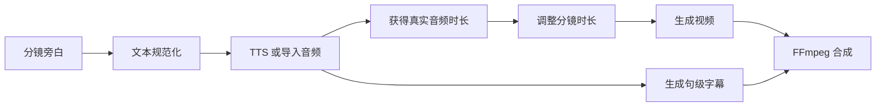
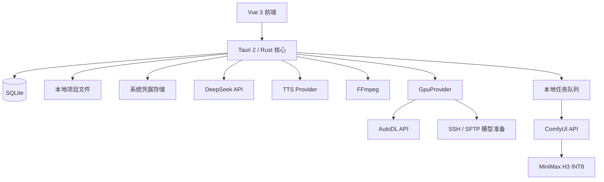

# 知画 MVP 产品与开发说明

> 版本：0.2  
> 状态：开发基线  
> 最近更新：2026-09-07  
> 产品性质：非盈利、开源、本地优先、用户自备模型服务与算力  
> 目标平台：Windows 桌面端优先，架构保留跨平台能力

## 1. 产品定义

“知画”是一款面向教师、科普人员、学校宣传人员、公益组织和基层宣传工作者的桌面工具，用于把课件、文档和文字资料快速整理为简短的中文科普动画。

产品不追求成为专业视频剪辑软件，也不提供模型商城或平台积分体系。MVP 的核心价值是：

1. 将资料转换为可审核的知识点、旁白和分镜。
2. 用简单的分镜卡片组织参考素材、旁白和视频生成任务。
3. 通过用户自己的 DeepSeek、AutoDL、ComfyUI 和 MiniMax H3 完成生成，并由桌面端尽量隐藏底层算力操作。
4. 保留每段内容的资料来源，让工作人员能核对事实。
5. 将生成片段、旁白、字幕和音乐组合为可直接使用的 MP4。

一句话定位：

> 导入课件，审核分镜，按需调用自己的算力生成科普动画。

## 2. MVP 成功标准

一名没有 ComfyUI 使用经验的教师能够完成以下流程：

1. 新建一个项目。
2. 导入 PDF、PPTX、DOCX、TXT 或粘贴文字。
3. 使用 DeepSeek 提取知识点并生成分镜初稿。
4. 审核、修改和重新排序分镜。
5. 为项目和分镜上传参考图片。
6. 生成系统旁白或导入已有录音。
7. 在 AutoDL 上通过 ComfyUI + H3 生成单个或多个视频片段。
8. 为每个分镜选择正式版本。
9. 调整简单的时间线、字幕、转场和音量。
10. 导出一段约 30～90 秒的 MP4 视频。

完成上述流程时，用户不需要查看或编辑 ComfyUI 节点图、工作流 JSON、模型文件名和采样器参数。

## 3. 已确定的产品决策

### 3.1 MVP 使用的生成链路

- 文本规划：DeepSeek API。
- 视频生成：用户自己的 AutoDL 实例。
- 云算力管理：MVP 实现 AutoDL 状态读取、GPU 模式开关机和服务健康检查；首次无卡开机仍需用户在 AutoDL 网页完成一次。
- 工作流执行：ComfyUI API。
- 视频模型：MiniMax H3 INT8 量化工作流。
- 视频合成：桌面端调用 FFmpeg。
- 项目数据：本地 SQLite 和本地项目目录。

### 3.2 图片生成暂不实现

MVP 不内置文生图或图片编辑模型。用户可以从豆包、GPT、Nano Banana、Qwen Chat 等外部工具生成图片，然后通过上传、拖入或剪贴板粘贴的方式导入知画。

MVP 必须实现完整的图片资产管理能力：

- 上传、拖入、粘贴图片。
- 裁切和画幅适配。
- 标记角色、场景、道具、风格、首帧和尾帧。
- 关联一个或多个分镜。
- 记录来源、提示词和版本。
- 将素材自动映射到 H3 工作流的参考输入。

未来可以通过 `ImageProvider` 接入 Qwen-Image-Edit 等模型，但不进入当前开发范围。

### 3.3 TTS 纳入 MVP

科普内容需要准确、可控的旁白。H3 原生音频可以作为环境音或表演声音，但不能作为正式旁白的唯一来源。

MVP 提供：

- 系统 TTS。
- 导入 WAV、MP3 等已有音频。
- 每个分镜独立生成或替换旁白。
- 语速和音量调整。
- 数字、单位和专业术语的读音预览。
- 根据旁白实际长度计算分镜时长。

Windows MVP 优先调用系统语音能力。实现必须经过 `TtsProvider` 接口，后续可增加 sherpa-onnx、CosyVoice 或商业 TTS 适配器。

录音功能属于增强项；如果开发成本可控，可在 MVP 后半程加入，不阻塞主链路验收。

### 3.4 不实现费用功能

MVP 不实现费用估算、项目预算、单镜头成本、余额、积分或计费统计。

- 顶栏不显示预计费用。
- 生成按钮不显示预计费用。
- 导出页不显示项目生成费用。
- 设置页不保存任何计费规则。

原型图中出现的金额属于早期视觉占位，开发时必须忽略。界面只展示 AutoDL 连接状态、实例状态、任务状态和队列状态。

### 3.5 商业视频 API 暂不实现

代码保留视频服务抽象层，但 MVP 只实现 `ComfyUIH3Provider`。不接入 Seedance、Runway、可灵、MiniMax 商业 API 等真实服务。

### 3.6 云算力平台决策

MVP 主平台继续使用 AutoDL，原因如下：

- RTX 5090 + MiniMax H3 INT8 链路已经得到用户侧验证。
- AutoDL 仍提供账号级 30GB 私有镜像免费额度，维护者可以把环境镜像控制在免费额度内。
- 当前阶段优先验证资料编排、分镜、旁白、视频生成和导出体验，不同时承担第二个平台的适配风险。

AutoDL 环境镜像只包含 ComfyUI、Python 依赖、自定义节点、知画后端、固定工作流、模型下载与校验脚本，不包含 H3 权重，目标镜像大小小于 30GB。H3 权重由用户首次使用时下载到 AutoDL 数据盘。

优云智算作为下一阶段优先适配的平台，定位为“一键模式”：

- API 支持无卡启动，可自动完成模型下载、校验、关机、GPU 启动和服务探活。
- API 提供实例创建、价格与库存查询、监控、镜像、磁盘和定时关机等能力。
- 2026 年 9 月最新产品更新公告已取消自制镜像 30GB 免费额度，按 `0.008 元/GB/日` 计费；虽然通用计费页仍显示旧规则，项目按最新专项公告处理。
- MVP 只保留 `GpuProvider` 扩展点，不实现 `CompShareProvider`，避免扩大首版范围。

最终产品允许用户选择算力平台且费用完全由用户自己的平台账号承担。知画不代充值、不抽成、不售卖算力，也不在界面中估算费用。

### 3.7 H3 模型与镜像策略

MVP 默认使用精简模型组合，不下载模型仓库中的全部精度和变体：

| 模型档案 | 内容 | 约占用 | MVP 要求 |
| --- | --- | ---: | --- |
| 核心档案 | FL2VA Pruned INT8、量化文本编码器、Video VAE、Audio VAE | 42.5GB | 必须 |
| 参考生成扩展 | Ref2VA Pruned INT8 | 额外约 21GB | 可选增强 |

AutoDL 默认 50GB 数据盘虽然可能勉强容纳核心权重，但没有足够的缓存、临时文件和生成结果余量。首次准备前必须检测真实可用空间；核心档案建议至少有 60GB 可用空间，安装 Ref2VA 时建议至少有 85GB 可用空间。空间不足时停止下载并给出扩容或精简模型的指引，不能静默填满磁盘。

如果未来公开分发包含 H3 权重的镜像，必须附带 MiniMax H3 许可证、`NOTICE` 和使用限制说明，并在发布前确认平台地域限制。MVP 采用“环境镜像 + 用户首次下载权重”的方式降低维护成本和再分发风险。

### 3.8 界面主题

MVP 提供浅色、深色和跟随系统三种主题。浅色为默认设计基线；主题切换即时生效并保存到本机设置。两套主题必须保持相同信息层级、状态颜色语义和无障碍对比度。

## 4. 用户与使用场景

### 4.1 目标用户

- 中小学教师和教研人员。
- 学校宣传、校园安全和德育工作人员。
- 科技馆、博物馆和科普场馆工作人员。
- 卫生、消防、反诈、应急和社区宣传人员。
- 公益组织和非营利机构内容人员。

### 4.2 典型内容

- 课程知识点说明。
- 实验原理和自然现象解释。
- 校园安全、消防、反诈和健康宣传。
- 活动介绍和公共服务说明。
- 课件的短视频补充材料。

## 5. 信息架构

主导航包含五个页面：

| 页面 | 主要职责 |
| --- | --- |
| 项目 | 新建、搜索、打开和管理项目 |
| 资料 | 导入资料、提取内容、生成知识点和核对来源 |
| 分镜 | 编辑旁白和画面方案、生成视频、选择版本、编排时间线 |
| 素材 | 管理参考图、角色、场景、道具、音频和视觉规范 |
| 导出 | 成片预览、完整性检查、编码设置和文件导出 |

“设置与算力”入口位于侧栏底部，用于配置 DeepSeek、AutoDL、ComfyUI、TTS、FFmpeg、本地存储和界面主题，并承担首次模型准备和日常实例状态管理。

## 6. 核心用户流程


设计原则是“先审核内容，再消耗算力”。DeepSeek 生成的大纲、旁白和提示词都允许用户在提交视频任务前修改。

### 6.1 首次算力准备流程


首次准备属于引导式半自动流程。应用必须明确告诉用户唯一需要离开知画完成的步骤，并提供“打开 AutoDL 控制台”和“我已完成无卡开机”按钮。其余下载、断点续传、校验、关机和状态更新由应用负责。

### 6.2 日常生成流程


自动关机默认开启，执行前显示短暂倒计时并允许取消。应用退出、网络中断或任务失败时不得盲目重复提交任务，应先恢复远端状态。

## 7. 页面需求

设计稿目录：[`design/`](./design/)

### 7.1 项目页

参考设计：[`design/mvp-projects.png`](./design/mvp-projects.png)

必须实现：

- 新建项目。
- 打开、重命名、复制和删除项目。
- 搜索项目。
- 按最近编辑时间和状态筛选。
- 展示项目封面、分镜数量、总时长、状态和最近编辑时间。
- 自动保存最近打开的项目。

项目状态：

- 草稿。
- 编排中。
- 生成中。
- 待导出。
- 已完成。

新建项目时只要求填写项目名称，可选填写目标受众和目标时长，其他内容进入项目后再补充。

### 7.2 资料页

参考设计：[`design/mvp-sources.png`](./design/mvp-sources.png)

必须实现：

- 拖拽或选择 PDF、PPTX、DOCX、TXT 和常见图片。
- 粘贴纯文本。
- 展示解析进度、成功和失败状态。
- 查看提取后的文本。
- 启用或停用某个资料来源。
- 删除资料。
- 使用 DeepSeek 提取目标受众、建议时长、核心知识点和事实清单。
- 每个知识点保存 `sourceRefs`，可以定位到文件、页码或段落。
- 对缺少来源或存在冲突的内容标记“需要确认”。
- 用户确认后才能进入正式分镜生成。

MVP 不要求完整还原 PPT 或 PDF 的排版，只需要可靠地提取文本和图片，并记录来源位置。

### 7.3 分镜页

参考设计：[`design/mvp-storyboard.png`](./design/mvp-storyboard.png)

这是 MVP 的核心页面。

#### 分镜卡片

每张卡片至少展示：

- 序号和标题。
- 画面缩略图。
- 旁白摘要。
- 目标时长。
- 生成状态。
- 当前正式版本。

支持：

- 新增、复制、删除分镜。
- 拖拽排序。
- 编辑标题、知识目的、旁白、屏幕文字和画面描述。
- 查看引用来源。
- 绑定参考素材。
- 生成、取消、重试当前分镜。
- 批量生成选中分镜。
- 在多个结果中选择正式版本。

#### 视频预览

- 播放当前分镜或完整时间线。
- 显示当前字幕效果。
- 支持适应窗口和全屏预览。
- 切换生成版本。
- 设置入点和出点。

#### 分镜设置

普通用户只看到以下控制：

- 旁白文本。
- 参考素材。
- 生成方式。
- 时长。
- 草稿质量或最终质量。
- 重新生成。

生成方式使用用户语言，不直接显示底层节点名称：

| 界面名称 | 底层能力 |
| --- | --- |
| 自由生成 | H3 文生视频 |
| 从这张画面开始 | H3 首帧图生视频 |
| 从画面 A 过渡到画面 B | H3 首尾帧视频 |
| 保持角色与场景 | H3 参考图/参考视频生成 |
| 延续上一镜头 | 使用上一片段或尾帧作为参考 |

#### 时间线

MVP 使用固定轨道，不实现任意多轨编辑：

1. 画面。
2. 旁白。
3. 字幕。
4. 音乐。

支持：

- 调整分镜顺序。
- 简单裁切。
- 设置分镜时长。
- 淡入淡出和基础转场。
- 调整旁白与音乐音量。
- 静音单条音轨。

不实现关键帧、蒙版、调色、曲线变速、复杂特效和自由多轨道。

### 7.4 素材页

参考设计：[`design/mvp-assets.png`](./design/mvp-assets.png)

必须实现：

- 上传、拖入和剪贴板粘贴图片。
- 导入 WAV、MP3 等音频。
- 按全部、角色、场景、道具、风格和音频分类。
- 搜索素材。
- 修改名称和分类。
- 查看尺寸、格式、来源和版本。
- 设置项目级参考素材。
- 关联或解除关联分镜。
- 替换文件但保留历史版本。
- 删除未使用素材。

项目视觉规范包括：

- 风格预设。
- 主色板。
- 线条和材质描述。
- 光线和背景复杂度。
- 角色设定图。
- 场景设定图。
- 禁止出现的元素。

MVP 不显示“生成图片”按钮。

### 7.5 导出页

参考设计：[`design/mvp-export.png`](./design/mvp-export.png)

必须实现：

- 播放完整成片。
- 展示分镜缩略图和总时长。
- 调整旁白、音乐和环境音音量。
- 检查分镜、旁白、字幕和来源记录是否完整。
- 选择保存位置。
- 导出 MP4。
- 显示导出进度、成功或失败原因。
- 导出失败后重试。

MVP 默认参数：

- 容器：MP4。
- 视频编码：H.264。
- 音频编码：AAC。
- 帧率：24 fps。
- 画布：16:9。
- 字幕：默认嵌入画面，同时允许保存 SRT。

导出页不展示任何费用信息。原设计稿中的费用卡片应替换为输出分辨率、总时长和预计文件大小。

### 7.6 设置页

参考设计：[`design/mvp-settings-compute.png`](./design/mvp-settings-compute.png)

必须实现：

- DeepSeek API 地址、模型名称和密钥。
- AutoDL 开发者 Token、实例 ID 和“打开 AutoDL 控制台”。
- ComfyUI 服务地址、客户端标识和可选鉴权信息，默认尝试自动检测。
- 测试 DeepSeek 连接。
- 分别测试 AutoDL、SSH、知画后端和 ComfyUI 连接。
- 显示 AutoDL 实例的 GPU 型号、实例状态、服务状态和最后更新时间。
- 实例统一状态至少包括：未绑定、已关机、启动中、运行中、无卡运行、关机中、生成中、异常和库存不足。
- 首次准备向导：绑定实例、无卡准备、模型校验、准备完成。
- 检测 H3 模型文件、版本、大小、SHA-256 和磁盘可用空间。
- 显示模型下载、断点续传、校验和失败重试进度。
- 提供 GPU 启动、关机、连接服务和任务完成后自动关机开关。
- TTS 声音、语速和默认音量。
- FFmpeg 路径检测。
- 项目默认保存目录。
- 浅色、深色和跟随系统主题。
- 下载日志和诊断信息。

MVP 只要求用户在首次准备时手动完成一次 AutoDL 无卡开机。模型准备完成后，GPU 模式的日常开机、关机、状态轮询和任务完成自动关机由 AutoDL API 完成。由于 AutoDL API 当前不支持无卡开机，应用不得伪装成全自动初始化。

所有密钥和令牌必须保存在操作系统凭据存储中，不能以明文写入 SQLite、日志或项目文件。

## 8. DeepSeek 编排设计

不要使用一次超长请求同时完成资料总结、脚本、分镜和视频提示词。流程拆为三个阶段。

### 8.1 内容规划

输入：

- 已启用的资料文本。
- 目标受众。
- 目标时长。
- 用户补充要求。

输出：

- 核心知识点。
- 内容大纲。
- 事实清单。
- 每条事实的来源引用。
- 缺失信息和需要确认的问题。

### 8.2 导演规划

用户确认内容大纲后，生成：

- 分镜目的。
- 旁白。
- 屏幕文字。
- 画面方案。
- 建议时长。
- 资料引用。
- 建议生成方式。
- 建议参考素材。

### 8.3 H3 提示词编译

提交生成前，将以下内容编译成 H3 提示词：

- 项目视觉规范。
- 角色和场景描述。
- 当前分镜画面目标。
- 动作。
- 镜头语言。
- 时间顺序。
- 参考素材标签。
- 禁止元素。

DeepSeek 不能直接创建或修改 ComfyUI 工作流 JSON。程序只允许将已验证字段注入固定、带版本号的工作流模板。

## 9. 旁白与字幕流程



规则：

- 一个分镜对应一段独立旁白音频。
- 旁白变更后，将该段音频和字幕标记为过期。
- 生成视频前提示用户重新生成旁白。
- 分镜目标时长默认为 `旁白时长 + 0.4 秒`。
- 超出 H3 单段合理时长时，提示拆分分镜。
- 字幕文本以旁白脚本为准，不通过 ASR 反向生成。
- MVP 使用句级或短语级时间戳，不要求逐字高亮。

## 10. 风格一致性方案

风格一致性不能依赖相同 seed。MVP 通过以下机制降低漂移。

### 10.1 项目级风格锁

创建 `StyleProfile`，并自动加入所有分镜提示词：

```ts
interface StyleProfile {
  preset: "flat_education" | "paper_cut" | "whiteboard" | "soft_3d"
  palette: string[]
  lineStyle: string
  lighting: string
  backgroundComplexity: "simple" | "medium"
  characterRendering: string
  cameraLanguage: string
  forbiddenElements: string[]
}
```

### 10.2 参考资产集

项目可以指定：

- 风格参考图。
- 角色设定图。
- 常用场景图。
- 道具图。
- 已确认的视频片段。

生成时由程序按照素材类型映射到 H3 的参考输入，并在提示词中使用稳定的参考标签。

### 10.3 生成策略

- 无固定主体的镜头可以使用文生视频。
- 有固定人物、教室、实验场景时优先使用图生视频或参考生成。
- 状态变化优先使用首尾帧。
- 连续镜头可以使用上一镜头尾帧或上一视频作为参考。
- 避免连续多个相似全景，使用特写、示意图和文字卡片作为自然切换。

### 10.4 确定性叠加

以下元素不交给视频模型生成，而由桌面端或 FFmpeg 叠加：

- 字幕和标题。
- 数字、单位和公式。
- 箭头、标签和警示信息。
- Logo 和署名。
- 简单图表。

### 10.5 版本追踪

每个视频版本保存：

- 模型标识。
- 工作流模板版本。
- 提示词。
- seed。
- 参考素材版本。
- 分辨率、帧数、步数和质量档位。
- 生成时间和任务状态。

## 11. 技术架构



### 11.1 前端建议

- Vue 3。
- TypeScript。
- Vite。
- Pinia。
- Vue Router。
- UI 组件库选用一套即可，不同时混用多套。
- 拖拽排序使用轻量库。
- 视频与音频预览优先使用浏览器原生能力。

### 11.2 Tauri 核心职责

- 项目和文件管理。
- SQLite 数据访问。
- 安全读取密钥。
- DeepSeek 请求。
- ComfyUI 上传、提交、查询、取消和下载。
- AutoDL 实例状态、GPU 模式启停和自动关机。
- 通过 SSH/SFTP 执行模型断点下载、清单校验和服务初始化。
- 后台任务持久化。
- FFmpeg 调用。
- TTS 调用。
- 日志和故障诊断。

前端不能直接持有 DeepSeek 密钥、AutoDL 令牌、SSH 凭据或执行任意系统命令。

### 11.3 Provider 接口

```ts
interface LlmProvider {
  analyzeSources(request: AnalyzeRequest): Promise<ContentPlan>
  createStoryboard(request: StoryboardRequest): Promise<SceneDraft[]>
  compileVideoPrompt(request: PromptCompileRequest): Promise<string>
}

interface VideoProvider {
  getCapabilities(): Promise<VideoCapabilities>
  validate(request: VideoRequest): Promise<ValidationResult>
  submit(request: VideoRequest): Promise<VideoJob>
  getStatus(jobId: string): Promise<VideoJobStatus>
  cancel(jobId: string): Promise<void>
  getResult(jobId: string): Promise<VideoResult>
}

interface TtsProvider {
  listVoices(): Promise<TtsVoice[]>
  synthesize(request: TtsRequest): Promise<TtsResult>
}

interface ImageProvider {
  getCapabilities(): Promise<ImageCapabilities>
  generate(request: ImageRequest): Promise<ImageJob>
  edit(request: ImageEditRequest): Promise<ImageJob>
}

type GpuStartMode = "gpu" | "cpu_no_gpu"

interface GpuProvider {
  getCapabilities(): Promise<GpuProviderCapabilities>
  listInstances(): Promise<GpuInstance[]>
  getInstance(instanceId: string): Promise<GpuInstance>
  start(instanceId: string, mode: GpuStartMode): Promise<void>
  stop(instanceId: string): Promise<void>
  getAccessInfo(instanceId: string): Promise<GpuAccessInfo>
  getMetrics(instanceId: string): Promise<GpuMetrics | null>
}
```

MVP 实现：

- `DeepSeekProvider`。
- `ComfyUIH3Provider`。
- `SystemTtsProvider`。
- `AutoDlGpuProvider`，其中 `cpu_no_gpu` 能力明确返回不支持。

`ImageProvider` 只定义接口，不提供实现。

预留但不实现：

- `CompShareProvider`：未来利用优云 API 实现无卡启动、实例创建、库存查询、监控和磁盘管理。
- 商业视频、图片和在线 TTS Provider。

## 12. ComfyUI 与 H3 集成

### 12.1 工作流模板

应用内维护经过测试的只读模板：

- `h3-t2v-v1.json`。
- `h3-i2v-v1.json`。
- `h3-flf2v-v1.json`。
- `h3-r2v-v1.json`。

程序只能修改白名单字段：

- 正向提示词。
- 参考图片、视频和音频。
- 宽度和高度。
- 帧数或时长。
- seed。
- 草稿或最终质量参数。

禁止让 LLM 输出或改写工作流节点、连接和模型路径。

### 12.2 质量档位

用户只看到两个档位：

| 档位 | 用途 | 建议设置 |
| --- | --- | --- |
| 草稿质量 | 快速检查动作、构图和参考图 | 较低分辨率、Turbo、较少步数 |
| 最终质量 | 用户确认画面后输出正式片段 | 目标分辨率、稳定工作流、较多步数 |

具体节点参数放在版本化模板中，不作为普通 UI 设置。高级设置只用于诊断。

### 12.3 任务状态

统一状态枚举：

```ts
type JobStatus =
  | "queued"
  | "uploading"
  | "running"
  | "downloading"
  | "completed"
  | "failed"
  | "cancelled"
  | "interrupted"
```

应用重启后必须恢复未完成任务记录。无法确认远端状态时标记为 `interrupted`，由用户选择重新查询或重试，不能静默重复提交。

### 12.4 AutoDL 环境镜像与模型准备

维护者发布的 AutoDL 镜像应控制在 30GB 以内，并遵循以下布局原则：

```text
系统盘（进入镜像）
├── ComfyUI 与 Python 环境
├── 知画后端服务
├── 自定义节点与版本化工作流
├── /start.d/ 服务启动脚本
├── 模型下载、断点续传和校验脚本
└── LICENSE、NOTICE 与模型清单

/root/autodl-tmp（不进入镜像）
├── models/
├── input/
├── output/
└── cache/
```

约束：

- 任何模型路径都通过配置或软链接指向数据盘，不能意外下载到系统盘。
- 环境镜像中不得包含维护者或测试账号的 API 密钥、SSH 私钥、Cookie、输入资料和生成结果。
- `MODEL_MANIFEST.json` 记录模型文件名、目标路径、预期大小、SHA-256、版本和许可证。
- 下载支持断点续传；校验失败只重下损坏文件。
- H3 核心档案准备成功后才允许提交生成任务。
- `h3-r2v-v1.json` 只有在 Ref2VA 扩展安装完成时启用，否则界面隐藏“保持角色与场景”生成方式并给出安装入口。
- 模型和节点升级不能静默进行，必须通过带版本号的清单迁移。

服务启动脚本必须幂等：重复执行不会重复安装依赖或覆盖用户数据；GPU 模式启动时自动拉起知画后端和 ComfyUI，无卡模式只执行准备与诊断任务。

## 13. 核心数据模型

```ts
interface Project {
  id: string
  title: string
  audience?: string
  targetDurationSec?: number
  status: "draft" | "planning" | "generating" | "ready" | "completed"
  styleProfile: StyleProfile
  createdAt: string
  updatedAt: string
}

interface SourceDocument {
  id: string
  projectId: string
  name: string
  type: "pdf" | "pptx" | "docx" | "txt" | "image" | "pasted_text"
  filePath?: string
  extractedTextPath?: string
  enabled: boolean
  parseStatus: "pending" | "parsing" | "ready" | "failed"
}

interface SourceReference {
  sourceId: string
  page?: number
  paragraph?: number
  quote?: string
}

interface Scene {
  id: string
  projectId: string
  order: number
  title: string
  purpose: string
  sourceRefs: SourceReference[]
  narration: string
  onScreenText: string[]
  visualPlan: string
  generationMode: "t2v" | "i2v" | "flf2v" | "r2v" | "continue"
  targetDurationMs: number
  assetIds: string[]
  selectedVersionId?: string
  status: "draft" | "ready" | "generating" | "generated" | "approved" | "failed"
}

interface VisualAsset {
  id: string
  projectId: string
  name: string
  type: "character" | "scene" | "prop" | "style" | "first_frame" | "last_frame"
  source: "upload" | "clipboard"
  filePath: string
  prompt?: string
  version: number
}

interface MediaVersion {
  id: string
  sceneId: string
  kind: "video" | "narration"
  filePath: string
  prompt?: string
  seed?: number
  workflowVersion?: string
  durationMs: number
  createdAt: string
}
```

## 14. 本地文件结构

建议一个项目对应一个独立目录：

```text
projects/<project-id>/
├── project.json
├── sources/
├── extracted/
├── assets/
│   ├── images/
│   └── audio/
├── scenes/
│   └── <scene-id>/
│       ├── drafts/
│       ├── final/
│       └── narration/
├── subtitles/
├── exports/
└── cache/
```

SQLite 保存关系、状态和索引；大型媒体文件保存在项目目录。项目应可以整体复制和备份。

## 15. 自动保存与版本规则

- 文本编辑停止后短暂延迟自动保存。
- 切换页面和关闭窗口前强制保存。
- 生成媒体不覆盖旧版本。
- 用户选择某个正式版本后，仅更新引用关系。
- 删除被时间线引用的媒体前必须提示。
- 应用异常退出后，项目文本和任务状态可以恢复。
- 缓存可以清理，项目源文件和正式媒体不能被自动清理。

## 16. 错误处理

必须提供用户可理解的错误信息：

- DeepSeek 密钥错误、限流或结构化输出失败。
- 文件格式不支持或解析失败。
- ComfyUI 无法连接。
- 工作流缺少模型或节点。
- 参考素材上传失败。
- AutoDL Token 无效、实例不存在、GPU 库存不足或状态转换超时。
- 用户尚未完成首次无卡开机。
- 模型下载中断、校验失败或数据盘空间不足。
- AutoDL 实例关闭、ComfyUI 未就绪或任务中断。
- H3 显存不足。
- FFmpeg 不存在或导出失败。

错误提示应包含：发生了什么、是否影响已有数据、建议的下一步、可复制的诊断编号。详细堆栈只写入本地日志。

## 17. 非功能要求

### 17.1 隐私与安全

- 默认所有项目和媒体保存在本地。
- 上传到 DeepSeek 的内容必须在设置和首次调用时说明。
- 上传到 AutoDL 的素材范围必须与当前任务一致。
- DeepSeek 密钥、AutoDL Token 和 SSH 凭据只保存在操作系统凭据存储，不同步到任何知画服务。
- 密钥不得写入日志、SQLite、项目文件或导出的诊断包。
- 日志导出前自动遮蔽令牌、密钥和带鉴权参数的 URL。

### 17.2 可用性

- 普通用户不需要理解模型、节点或采样器。
- 所有耗时任务提供进度和取消按钮。
- 远端断开不导致本地项目损坏。
- 页面刷新和应用重启后不丢失编辑结果。
- 主要操作按钮使用明确动词。
- 浅色、深色和跟随系统主题均覆盖所有核心页面，切换主题不影响任务状态。
- 算力页面用“已关机、启动中、服务准备中、可生成”等用户语言，不暴露云平台内部状态码。

### 17.3 性能

- 媒体缩略图异步加载。
- 原视频不直接全部载入内存。
- 文件解析、上传、下载和 FFmpeg 在后台执行。
- 生成队列默认串行，避免单张显卡同时执行多个 H3 任务。

## 18. MVP 不做的功能

- 内置图片生成和图片编辑。
- 商业视频 API 的真实接入。
- AutoDL API 无卡开机自动化；首次无卡开机仍需用户进入网页完成一次。
- 自动购买、释放、扩容或迁移 AutoDL 实例。
- 优云智算等第二云平台的真实接入。
- 在线账号和云同步。
- 多人协作和权限系统。
- 平台积分、余额、预算和费用估算。
- 模型商城和工作流商城。
- 专业非线性剪辑器。
- 任意多轨、关键帧、蒙版和调色。
- 角色 LoRA 训练。
- 实时协同审核。
- 移动端。

## 19. 开发阶段

### 阶段一：跑通单分镜

- 初始化 Vue 3 + Tauri 2。
- 建立设置和安全凭据存储。
- 实现 DeepSeek 连接测试。
- 实现 AutoDL Token、实例绑定、状态读取和 GPU 模式启停。
- 实现首次无卡准备向导、SSH 模型下载和清单校验。
- 实现知画后端与 ComfyUI 连接测试和健康检查。
- 固定一套 H3 工作流。
- 完成提示词、首帧、时长和 seed 注入。
- 提交一个任务并下载、预览视频。

验收：用户只需在 AutoDL 网页完成一次无卡开机，随后可在知画内完成模型准备；输入一段旁白和画面描述并选择一张参考图后，可以自动启动 GPU、得到本地视频片段并按设置关机。

### 阶段二：项目、资料与分镜

- SQLite 和项目目录。
- 项目页。
- 资料导入和文本提取。
- DeepSeek 内容规划和导演规划。
- 分镜卡片增删改、排序和引用来源。
- 素材库和分镜绑定。

验收：用户可以从一份资料生成 5 个左右可编辑分镜，并保存后重新打开。

### 阶段三：旁白、任务和版本

- 系统 TTS 和音频导入。
- 句级字幕。
- 持久化任务队列。
- 草稿/最终质量。
- 取消、重试和故障恢复。
- 多版本选择。
- H3 首帧、首尾帧和参考生成。

验收：用户可以为全部分镜生成旁白和视频，并逐一选择正式版本。

### 阶段四：时间线与导出

- 固定四轨时间线。
- 裁切、转场和音量。
- 字幕样式。
- FFmpeg 合成。
- 导出检查和错误恢复。

验收：用户可以导出一段画面、旁白、字幕同步的 30～90 秒 MP4。

## 20. MVP 验收清单

### 项目与资料

- [ ] 可以创建、重命名、复制、删除和重新打开项目。
- [ ] 可以导入至少 PDF、PPTX、DOCX 和 TXT。
- [ ] 可以查看提取文本和来源位置。
- [ ] DeepSeek 输出可以通过结构校验，失败时可以重试。
- [ ] 每个知识点和分镜可以关联资料来源。

### 分镜与素材

- [ ] 可以生成、编辑、复制、删除和排序分镜。
- [ ] 可以上传、粘贴、分类和版本化参考图片。
- [ ] 可以为分镜指定首帧、尾帧、角色和场景素材。
- [ ] 可以设置并锁定项目视觉规范。

### 旁白与视频

- [ ] 可以生成系统 TTS 或导入旁白。
- [ ] 旁白时长可以驱动分镜时长。
- [ ] 可以绑定 AutoDL 实例并显示真实状态。
- [ ] 首次准备可以引导用户完成无卡开机，并自动下载、续传和校验核心模型。
- [ ] 可以通过 API 启动和关闭 GPU 模式实例。
- [ ] 可以检测知画后端、ComfyUI、H3 模型和 FFmpeg 是否就绪。
- [ ] 队列完成后可以按用户设置自动关机，并允许取消关机。
- [ ] 可以连接 ComfyUI 并提交 H3 任务。
- [ ] 可以查看队列、进度、失败原因并取消或重试。
- [ ] 可以生成草稿和最终版本。
- [ ] 每个分镜可以保留多个版本并选择正式版本。

### 导出与可靠性

- [ ] 可以预览完整时间线。
- [ ] 可以调整旁白和音乐音量。
- [ ] 可以导出 H.264 + AAC 的 MP4 和独立 SRT。
- [ ] 应用重启后项目、媒体版本和任务记录仍然存在。
- [ ] 日志不包含明文密钥。
- [ ] 浅色、深色和跟随系统主题可正常切换并持久化。
- [ ] 所有页面均不出现费用、预算、余额或积分功能。

## 21. 原型图使用说明

当前 v2 原型图用于表达布局和交互层级，不是逐像素实现要求：

- [`项目`](./design/mvp-projects.png)
- [`资料`](./design/mvp-sources.png)
- [`分镜`](./design/mvp-storyboard.png)
- [`素材`](./design/mvp-assets.png)
- [`导出`](./design/mvp-export.png)
- [`设置与算力`](./design/mvp-settings-compute.png)

实现时优先遵循本文档的功能范围。v2 原型已经移除费用、余额、预算和积分相关信息，并按当前 AutoDL、系统 TTS、素材上传及 Ref2VA 能力边界重新设计。

其余视觉方向保持：深蓝灰侧栏、靛蓝主操作、清晰中文排版和适合非专业用户的信息密度。浅色主题使用明亮内容区和白色卡片；深色主题保持相同布局、状态语义和视觉层级。

## 22. 云平台规则依据与复核要求

本文档记录的是 2026-09-07 的产品决策，云平台价格、容量、API 和回收规则可能变化，不能作为永久常量写死在业务代码中。

- AutoDL 镜像、磁盘与计费规则：<https://www.autodl.com/docs/price/>、<https://www.autodl.com/docs/env/>
- AutoDL Pro API 与无卡限制：<https://www.autodl.com/docs/instance_pro_api/>
- 优云智算最新 GPU 产品更新：<https://www.compshare.cn/docs/overview/announcement/update-gpu>
- 优云智算实例与磁盘规则：<https://www.compshare.cn/docs/operation/gpu/disk>
- 优云智算无卡启动 API：<https://compshare.cn/docs/gpus/instance/startcompshareinstance>

发布每个正式版本前必须重新核对上述页面。若通用计费页与专项更新公告冲突，先按更保守规则设计，再通过平台客服或实际账单确认。知画只依据 Provider 能力返回值启用功能，不依据平台名称猜测功能。
